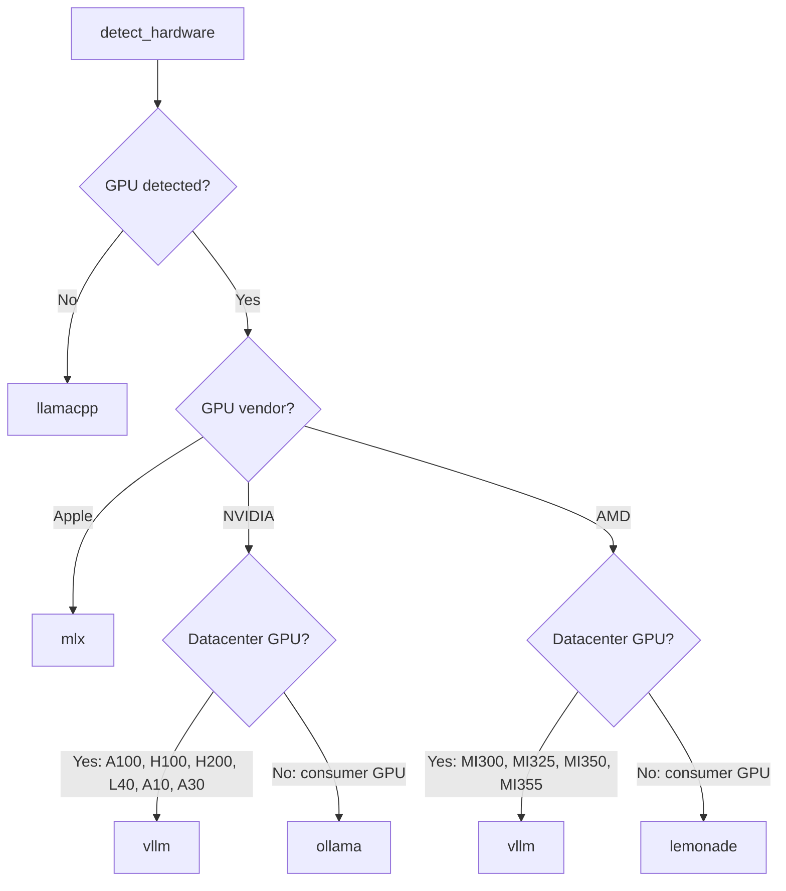

# AUTHOR INSTALL DOCS - open-jarvis/OpenJarvis a6dcf846 - pulled W90 2026-09-25T17:50:35

## ===== FILE: README.md =====
<div align="center">
  

  <p><i>Personal AI, On Personal Devices.</i></p>

  <p>
    <a href="https://arxiv.org/abs/2605.17172"></a>
    <a href="https://openjarvis.stanford.edu/"></a>
    <a href="https://open-jarvis.github.io/OpenJarvis/"></a>
    
    
    <a href="https://discord.gg/CMVBmDQ5Fj"></a>
    <a href="https://x.com/OpenJarvisAI"></a>
  </p>
</div>

---

<div align="center">
  
</div>

---

> **[Documentation](https://open-jarvis.github.io/OpenJarvis/)**
>
> **[Project Site](https://openjarvis.stanford.edu/)**
>
> **[Paper](https://arxiv.org/abs/2605.17172)**
>
> **[Leaderboard](https://open-jarvis.github.io/OpenJarvis/leaderboard/)**
>
> **[Roadmap](https://open-jarvis.github.io/OpenJarvis/development/roadmap/)**

## Why OpenJarvis?

Personal AI agents are exploding in popularity, but nearly all of them still route intelligence through cloud APIs. Your "personal" AI continues to depend on someone else's server. At the same time, our [Intelligence Per Watt](https://www.intelligence-per-watt.ai/) research showed that local language models already handle 88.7% of single-turn chat and reasoning queries, with intelligence efficiency improving 5.3× from 2023 to 2025. The models and hardware are increasingly ready. What has been missing is the software stack to make local-first personal AI practical.

OpenJarvis is that stack. It is a framework for local-first personal AI, built around three core ideas: shared primitives for building on-device agents; evaluations that treat energy, FLOPs, latency, and dollar cost as first-class constraints alongside accuracy; and a learning loop that improves models using local trace data. The goal is simple: make it possible to build personal AI agents that run locally by default, calling the cloud only when truly necessary. OpenJarvis aims to be both a research platform and a production foundation for local AI, in the spirit of PyTorch.

## Installation

Pick your platform and run one command. Each installer handles [uv](https://docs.astral.sh/uv/), the Python venv, Ollama, and a starter model ΓÇö about 3 minutes on broadband.

| Platform | One-liner |
|---|---|
| **macOS ┬╖ Linux ┬╖ WSL2** | `curl -fsSL https://open-jarvis.github.io/OpenJarvis/install.sh \| bash` |
| **Native Windows** | `irm https://open-jarvis.github.io/OpenJarvis/install.ps1 \| iex` |
| **Desktop GUI** | Download `.exe` / `.dmg` / `.deb` / `.rpm` / `.AppImage` from the [latest release](https://github.com/open-jarvis/OpenJarvis/releases) |

Then `jarvis` to start. The Rust extension and larger models continue downloading in the background; `jarvis doctor` shows status.

Platform-specific notes (WSL2 setup, native-Windows scheduled-task service, desktop prerequisites, manual / contributor install): see the [installation docs](https://open-jarvis.github.io/OpenJarvis/getting-started/install/).

## Quick Start

```bash
jarvis                          # start chatting (default: chat-simple)
jarvis init --preset <name> --force  # replace config with a starter preset
```

> Prefix `jarvis ...` with `uv run`, or `source .venv/bin/activate` first.

| Preset | What it does |
|---|---|
| `morning-digest-mac` / `morning-digest-linux` / `morning-digest-minimal` | Spoken daily briefing from email, calendar, health, news |
| `deep-research` | Multi-hop research across indexed docs with citations |
| `code-assistant` | Agent with code execution, file I/O, and shell access |
| `scheduled-monitor` | Stateful agent on a schedule with memory |
| `chat-simple` | Lightweight conversation, no tools |

Example:

```bash
jarvis init --preset morning-digest-mac --force
jarvis connect gdrive          # one OAuth covers Gmail / Calendar / Tasks
jarvis digest --fresh          # generate and play your first briefing
```

Per-preset deep dives: [morning digest](https://open-jarvis.github.io/OpenJarvis/user-guide/morning-digest/) ┬╖ [deep research](https://open-jarvis.github.io/OpenJarvis/user-guide/deep-research/) ┬╖ [code assistant](https://open-jarvis.github.io/OpenJarvis/user-guide/code-assistant/) ┬╖ [scheduled monitor](https://open-jarvis.github.io/OpenJarvis/user-guide/scheduled-monitor/) ┬╖ [chat simple](https://open-jarvis.github.io/OpenJarvis/user-guide/chat-simple/) ┬╖ or the full [quickstart guide](https://open-jarvis.github.io/OpenJarvis/getting-started/quickstart/).

### Skills

Skills teach agents how to better use tools and improve their reasoning. Every skill is a tool ΓÇö agents discover them from a catalog and invoke them on demand.

```bash
# Install skills from public sources
jarvis skill install hermes:arxiv
jarvis skill sync hermes --category research

# Use skills with any agent
jarvis ask "Use the code-explainer skill to explain this Python code: for i in range(5): print(i*2)"

# Optimize skills from your trace history
jarvis optimize skills --policy dspy

# Benchmark the impact
jarvis bench skills --max-samples 5 --seeds 42
```

Import from [Hermes Agent](https://github.com/NousResearch/hermes-agent) (~150 skills), [OpenClaw](https://github.com/openclaw/skills) (~13,700 community skills), or any GitHub repo. Skills follow the [agentskills.io](https://agentskills.io/specification) open standard.

See the [Skills User Guide](https://open-jarvis.github.io/OpenJarvis/user-guide/skills/) and [Skills Tutorial](https://open-jarvis.github.io/OpenJarvis/tutorials/skills-workflow/) for details.

### Built-in Agents

OpenJarvis ships with eight built-in agents across three execution modes (on-demand, scheduled, continuous):

| Agent | Type | What it does |
|-------|------|-------------|
| `morning_digest` | Scheduled | Daily briefing from email, calendar, health, news ΓÇö with TTS audio |
| `deep_research` | On-demand | Multi-hop research with citations across web and local docs |
| `monitor_operative` | Continuous | Long-horizon monitoring with memory, compression, and retrieval |
| `orchestrator` | On-demand | Multi-turn reasoning with automatic tool selection |
| `native_react` | On-demand | ReAct (Thought-Action-Observation) loop agent |
| `operative` | Continuous | Persistent autonomous agent with state management |
| `native_openhands` | On-demand | CodeAct ΓÇö generates and executes Python code |
| `simple` | On-demand | Single-turn chat, no tools |

See the [User Guide](https://open-jarvis.github.io/OpenJarvis/user-guide/morning-digest/) and [Tutorials](https://open-jarvis.github.io/OpenJarvis/tutorials/) for detailed setup instructions.

Full documentation ΓÇö including Docker deployment, cloud engines, development setup, and tutorials ΓÇö at **[open-jarvis.github.io/OpenJarvis](https://open-jarvis.github.io/OpenJarvis/)**.

## Community

- **GitHub:** [github.com/open-jarvis/OpenJarvis](https://github.com/open-jarvis/OpenJarvis)
- **Discord:** [discord.gg/CMVBmDQ5Fj](https://discord.gg/CMVBmDQ5Fj)
- **X / Twitter:** [@OpenJarvisAI](https://x.com/OpenJarvisAI)
- **Docs:** [open-jarvis.github.io/OpenJarvis](https://open-jarvis.github.io/OpenJarvis/)

## Contributing

We welcome contributions! See the [Contributing Guide](CONTRIBUTING.md) for incentives, contribution types, and the PR process.

Quick start for contributors:

```bash
git clone https://github.com/open-jarvis/OpenJarvis.git
cd OpenJarvis
uv sync --extra dev
uv run pre-commit install
uv run pytest tests/ -v
```

Browse the [Roadmap](https://open-jarvis.github.io/OpenJarvis/development/roadmap/) for areas where help is needed. Comment **"take"** on any issue to get auto-assigned.

## About

OpenJarvis is part of [Intelligence Per Watt](https://www.intelligence-per-watt.ai/), a research initiative studying the intelligence efficiency of AI systems. The project is developed at [Hazy Research](https://hazyresearch.stanford.edu/) and the [Scaling Intelligence Lab](https://scalingintelligence.stanford.edu/) at [Stanford SAIL](https://ai.stanford.edu/).

## Sponsors

<p>
  <a href="https://www.laude.org/">Laude Institute</a> &bull;
  <a href="https://datascience.stanford.edu/marlowe">Stanford Marlowe</a> &bull;
  <a href="https://cloud.google.com/">Google Cloud Platform</a> &bull;
  <a href="https://lambda.ai/">Lambda Labs</a> &bull;
  <a href="https://ollama.com/">Ollama</a> &bull;
  <a href="https://research.ibm.com/">IBM Research</a> &bull;
  <a href="https://hai.stanford.edu/">Stanford HAI</a>
</p>

## Citation
```bibtex
@misc{saadfalcon2026openjarvispersonalaipersonal,
      title={OpenJarvis: Personal AI, On Personal Devices}, 
      author={Jon Saad-Falcon and Avanika Narayan and Robby Manihani and Tanvir Bhathal and Herumb Shandilya and Hakki Orhun Akengin and Gabriel Bo and Andrew Park and Matthew Hart and Caia Costello and Chuan Li and Christopher Ré and Azalia Mirhoseini},
      year={2026},
      eprint={2605.17172},
      archivePrefix={arXiv},
      primaryClass={cs.LG},
      url={https://arxiv.org/abs/2605.17172}, 
}
```

## License

[Apache 2.0](LICENSE)

## ===== FILE: CONTRIBUTING.md =====
# Contributing to OpenJarvis

Thank you for your interest in contributing to OpenJarvis! This guide covers everything you need to know ΓÇö from why to contribute, to how to submit your first pull request.

---

## Why Contribute?

Contributing to OpenJarvis isn't just about code ΓÇö it's about building the future of on-device AI together. Here's what you get:

### Paper Acknowledgment

All contributors with merged pull requests will be acknowledged as contributors on the OpenJarvis paper release.

### Mac Mini Giveaway

We're giving away a Mac Mini to one lucky contributor! Install OpenJarvis on your personal machine and opt in via the desktop app to share anonymized savings data (FLOPs, dollar cost, energy) for a chance to win. Your data is fully anonymous ΓÇö no IP, no hardware info beyond savings metrics. You must share your email via the desktop app to be eligible.

See the [Savings Leaderboard](https://open-jarvis.github.io/OpenJarvis/leaderboard/) for details.

### Path to Maintainership

Consistent contributors can grow into project maintainers:

- **Contributor** ΓÇö anyone with a merged PR
- **Reviewer** ΓÇö invited after 3+ merged PRs in a domain area, can review PRs
- **Maintainer** ΓÇö reviewers who demonstrate sustained engagement and good judgment

### Recognition

Contributors are recognized in release notes and on our GitHub repository.

---

## Ways to Contribute

### Good First Contributions

These are great starting points for new contributors:

- Documentation improvements and typo fixes
- Bug reports with reproducible steps
- New eval datasets and scorers
- Test coverage improvements

Look for issues labeled [`good-first-issue`](https://github.com/open-jarvis/OpenJarvis/labels/good-first-issue).

### Ideal Contributions

- Bug fixes with tests
- Performance improvements
- New tools, engines, or agents following the [registry pattern](docs/development/contributing.md#registry-pattern)
- New channel integrations (Telegram, Discord, Slack, etc.)

### Harder to Review

These require more context and review time. **Please open an issue for discussion before starting a PR:**

- New primitives or major extensions to existing ones
- Large refactors
- Changes to core abstractions (`BaseAgent`, `InferenceEngine`, etc.)

### May Not Be Accepted

To avoid wasted effort, note that PRs in these categories are unlikely to be merged:

- Changes that break backwards compatibility in the public API
- Changes that add significant new dependencies without justification
- Changes that add friction to the user experience

---

## Getting Started

### Prerequisites

| Requirement | Version | Notes |
|---|---|---|
| Python | 3.10+ | Required |
| [uv](https://docs.astral.sh/uv/) | Latest | Package manager |
| Node.js | 22+ | Only needed for ClaudeCodeAgent and WhatsApp channel |

### Setup

```bash
git clone https://github.com/open-jarvis/OpenJarvis.git
cd OpenJarvis
uv sync --extra dev
```

### Pre-commit Hooks

We use [pre-commit](https://pre-commit.com/) to run linting and formatting checks before each commit:

```bash
uv run pre-commit install
```

This installs Git hooks that automatically run [Ruff](https://docs.astral.sh/ruff/) on every commit. If the hooks fail, fix the issues and commit again.

For detailed development setup, code conventions, and project structure, see the [Development Guide](docs/development/contributing.md).

---

## Claiming Issues

1. Browse the [Roadmap](https://open-jarvis.github.io/OpenJarvis/development/roadmap/) for an item that interests you
2. Check if a [GitHub issue](https://github.com/open-jarvis/OpenJarvis/issues) already exists for it ΓÇö if not, [open one](https://github.com/open-jarvis/OpenJarvis/issues/new/choose) describing what you'd like to work on
3. Comment **"take"** on the issue to get auto-assigned
4. Fork, branch, and start working

If you've claimed an issue but can't finish it, please leave a comment so someone else can pick it up.

---

## Proposing Changes

### Trivial Changes

For small fixes (typos, doc improvements, simple bug fixes), go ahead and open a PR directly.

### Non-trivial Changes

For larger changes ΓÇö new features, refactors, new dependencies ΓÇö **open an issue first** to discuss the approach. This saves everyone time by catching design issues early.

Use the appropriate [issue template](https://github.com/open-jarvis/OpenJarvis/issues/new/choose):
- **Bug Report** ΓÇö for bugs with reproduction steps
- **Feature Request** ΓÇö for new functionality
- **New Eval Dataset** ΓÇö for contributing benchmarks

---

## Pull Request Process

### Before Submitting

1. Run the full test suite:
   ```bash
   uv run pytest tests/ -v
   ```
2. Run the linter:
   ```bash
   uv run ruff check src/ tests/
   ```
3. Run the formatter:
   ```bash
   uv run ruff format --check src/ tests/
   ```
4. Add tests for new functionality
5. Follow the [registry pattern](docs/development/contributing.md#registry-pattern) for new components

### Commit Messages

We use [Conventional Commits](https://www.conventionalcommits.org/):

```
feat: add FAISS memory backend
fix: handle empty tool responses in orchestrator
docs: update engine discovery documentation
test: add coverage for BM25 backend
refactor: simplify agent base class helpers
```

Keep the first line under 72 characters. Reference relevant issues (e.g., `fixes #42`).

### What Makes a Good PR

- **Focused** ΓÇö one feature, fix, or refactor per PR
- **Tested** ΓÇö includes unit tests covering new code paths
- **Documented** ΓÇö updates docstrings and docs if adding public API
- **Backwards compatible** ΓÇö avoids breaking existing interfaces without discussion

---

## Contribution Areas

OpenJarvis is built on five composable primitives. Here's where you can contribute:

| Area | What to Build | Guide |
|---|---|---|
| **Intelligence** | Model catalog entries, routing strategies | [Dev Guide](docs/development/contributing.md) |
| **Engines** | New inference backends (e.g., TensorRT, ONNX) | [Dev Guide](docs/development/contributing.md) |
| **Agents** | New agent types, agent improvements | [Dev Guide](docs/development/contributing.md) |
| **Tools** | New tools (browser, API clients, etc.) | [Dev Guide](docs/development/contributing.md) |
| **Learning** | Router policies, reward functions, training | [Dev Guide](docs/development/contributing.md) |
| **Evals** | New datasets, scorers, benchmark configs | [Dev Guide](docs/development/contributing.md) |
| **Channels** | Chat platform integrations | [Dev Guide](docs/development/contributing.md) |
| **Rust Port** | PyO3 bindings, crate parity with Python | See `rust/` directory |

---

## Code of Conduct

This project follows the [Contributor Covenant Code of Conduct](CODE_OF_CONDUCT.md). By participating, you agree to uphold this code.

---

## Questions?

- Open a [Discussion](https://github.com/open-jarvis/OpenJarvis/discussions) for questions and help
- Check the [documentation](https://open-jarvis.github.io/OpenJarvis/) for guides and API reference

## ===== FILE: docs/development/contributing.md =====
# Contributing Guide

This guide covers how to set up a development environment, run tests, and
contribute code to OpenJarvis.

---

## Development Setup

### Prerequisites

| Requirement | Version | Notes |
|---|---|---|
| Python | 3.10+ | Required |
| [uv](https://docs.astral.sh/uv/) | Latest | Package manager |
| Node.js | 22+ | Only needed for ClaudeCodeAgent and WhatsApp channel |

### Clone and Install

```bash
git clone https://github.com/open-jarvis/OpenJarvis.git
cd OpenJarvis
uv sync --extra dev
```

This installs the package in editable mode along with all development
dependencies (pytest, ruff, respx, pytest-asyncio, pytest-cov).

!!! tip "Optional extras"
    Install additional extras for specific backends you want to work on:

    ```bash
    # Memory backends
    uv sync --extra dev --extra memory-faiss --extra memory-colbert --extra memory-bm25

    # Cloud inference
    uv sync --extra dev --extra inference-cloud --extra inference-google

    # API server
    uv sync --extra dev --extra server

    # Documentation
    uv sync --extra dev --extra docs
    ```

### Verify Installation

```bash
uv run jarvis --version   # Should print 0.1.0
uv run jarvis --help      # Show all subcommands
```

---

## Running Tests

OpenJarvis uses [pytest](https://docs.pytest.org/) with approximately 1,000+
tests organized by module.

### Full Test Suite

```bash
uv run pytest tests/ -v
```

### Run a Specific Test File

```bash
uv run pytest tests/core/test_registry.py -v
uv run pytest tests/engine/test_ollama.py -v
uv run pytest tests/memory/test_sqlite.py -v
```

### Run a Specific Test

```bash
uv run pytest tests/core/test_registry.py::test_register_and_get -v
```

### Run Tests by Module

```bash
uv run pytest tests/agents/ -v       # All agent tests
uv run pytest tests/tools/ -v        # All tool tests
uv run pytest tests/learning/ -v     # All learning tests
```

### Test Coverage

```bash
uv run pytest tests/ --cov=openjarvis --cov-report=html
```

### Test Markers

Tests that require specific hardware or running services are gated behind
pytest markers. By default, these tests are collected but will skip
gracefully if the requirement is not met.

| Marker | Description | Example |
|---|---|---|
| `live` | Requires a running inference engine (Ollama, vLLM, etc.) | `@pytest.mark.live` |
| `cloud` | Requires cloud API keys (`OPENAI_API_KEY`, etc.) | `@pytest.mark.cloud` |
| `nvidia` | Requires an NVIDIA GPU | `@pytest.mark.nvidia` |
| `amd` | Requires an AMD GPU with ROCm | `@pytest.mark.amd` |
| `apple` | Requires Apple Silicon | `@pytest.mark.apple` |
| `slow` | Long-running test | `@pytest.mark.slow` |

Run only tests matching a specific marker:

```bash
uv run pytest tests/ -m live -v          # Only live engine tests
uv run pytest tests/ -m "not slow" -v    # Skip slow tests
uv run pytest tests/ -m "not cloud" -v   # Skip cloud tests
```

!!! info "Registry isolation in tests"
    The test `conftest.py` includes an `autouse` fixture that clears all
    registries and resets the event bus before every test. This ensures
    complete isolation between tests. Modules that need their registrations
    to survive clearing use the `ensure_registered()` pattern described
    below.

---

## Linting

OpenJarvis uses [Ruff](https://docs.astral.sh/ruff/) for linting, configured
in `pyproject.toml`:

```bash
uv run ruff check src/ tests/
```

The Ruff configuration targets Python 3.10 and enables the following rule sets:

- **E** -- pycodestyle errors
- **F** -- Pyflakes
- **I** -- isort (import ordering)
- **W** -- pycodestyle warnings

Fix auto-fixable issues:

```bash
uv run ruff check src/ tests/ --fix
```

---

## Building Documentation

The documentation site uses [MkDocs Material](https://squidfunnel.com/mkdocs-material/).

```bash
# Install docs dependencies
uv sync --extra docs

# Serve locally with hot reload
uv run mkdocs serve --dev-addr 127.0.0.1:8001

# Build static site
uv run mkdocs build
```

The site configuration lives in `mkdocs.yml`. API reference pages use
[mkdocstrings](https://mkdocstrings.github.io/) to auto-generate from
docstrings with the NumPy docstring style.

---

## Project Structure

The source code is organized under `src/openjarvis/`:

```
src/openjarvis/
    __init__.py                 # Package root, __version__
    sdk.py                      # Jarvis class ΓÇö high-level Python SDK

    core/                       # Shared infrastructure
        config.py               # JarvisConfig, hardware detection, TOML loader
        events.py               # EventBus pub/sub system
        registry.py             # RegistryBase[T] and all typed registries
        types.py                # Message, ModelSpec, ToolResult, Trace, etc.

    intelligence/               # Model management and query routing
        model_catalog.py        # BUILTIN_MODELS, register/merge helpers
        router.py               # HeuristicRouter, build_routing_context

    engine/                     # Inference engine backends
        _stubs.py               # InferenceEngine ABC
        _base.py                # EngineConnectionError, messages_to_dicts
        _discovery.py           # discover_engines, discover_models, get_engine
        _openai_compat.py       # OpenAI-compatible wrapper
        ollama.py               # OllamaEngine
        openai_compat_engines.py   # Data-driven registration (vLLM, SGLang, llama.cpp, MLX, LM Studio)
        cloud.py                # CloudEngine (OpenAI/Anthropic/Google)

    agents/                     # Agent implementations
        _stubs.py               # BaseAgent ABC, ToolUsingAgent, AgentContext, AgentResult
        simple.py               # SimpleAgent ΓÇö single-turn, no tools
        orchestrator.py         # OrchestratorAgent ΓÇö multi-turn tool calling (function_calling + structured)
        native_react.py         # NativeReActAgent ΓÇö Thought-Action-Observation loop
        native_openhands.py     # NativeOpenHandsAgent ΓÇö CodeAct-style code execution
        rlm.py                  # RLMAgent ΓÇö recursive LM with persistent REPL
        openhands.py            # OpenHandsAgent ΓÇö wraps real openhands-sdk
        react.py                # Backward-compat shim (re-exports NativeReActAgent)
        claude_code.py          # ClaudeCodeAgent ΓÇö Claude Agent SDK via Node.js subprocess
        claude_code_runner/     # Bundled Node.js runner for the Claude Agent SDK

    memory/                     # Memory / retrieval backends
        _stubs.py               # MemoryBackend ABC, RetrievalResult
        sqlite.py               # SQLiteMemory ΓÇö FTS5 default backend
        faiss_backend.py        # FAISS vector backend
        colbert_backend.py      # ColBERTv2 backend
        bm25.py                 # BM25 backend
        hybrid.py               # Hybrid (RRF fusion) backend
        chunking.py             # ChunkConfig, chunk_text
        context.py              # ContextConfig, inject_context
        ingest.py               # ingest_path, read_document

    tools/                      # Tool system
        _stubs.py               # BaseTool ABC, ToolSpec, ToolExecutor
        calculator.py           # CalculatorTool ΓÇö safe AST math
        think.py                # ThinkTool ΓÇö reasoning scratchpad
        retrieval.py            # RetrievalTool ΓÇö memory search
        llm_tool.py             # LLMTool ΓÇö sub-model calls
        file_read.py            # FileReadTool ΓÇö safe file reading
        web_search.py           # WebSearchTool
        code_interpreter.py     # CodeInterpreterTool

    learning/                   # Router policies and reward functions
        _stubs.py               # RouterPolicy ABC, RewardFunction ABC
        heuristic_policy.py     # Wire HeuristicRouter to registry
        trace_policy.py         # TraceDrivenPolicy ΓÇö learns from traces
        grpo_policy.py          # GRPORouterPolicy ΓÇö RL training stub
        heuristic_reward.py     # HeuristicRewardFunction

    traces/                     # Full interaction recording
        store.py                # TraceStore ΓÇö SQLite persistence
        collector.py            # TraceCollector ΓÇö wraps agents
        analyzer.py             # TraceAnalyzer ΓÇö aggregated queries

    telemetry/                  # Inference telemetry
        store.py                # TelemetryStore ΓÇö SQLite persistence
        aggregator.py           # TelemetryAggregator ΓÇö per-model/engine stats
        wrapper.py              # instrumented_generate() wrapper

    bench/                      # Benchmarking framework
        _stubs.py               # BaseBenchmark ABC, BenchmarkSuite
        latency.py              # LatencyBenchmark
        throughput.py           # ThroughputBenchmark

    server/                     # OpenAI-compatible API server
        app.py                  # FastAPI application factory
        routes.py               # /v1/chat/completions, /v1/models, /health

    mcp/                        # MCP (Model Context Protocol) layer

    cli/                        # Click CLI commands
        __init__.py             # main group
        ask.py                  # jarvis ask
        init_cmd.py             # jarvis init
        model.py                # jarvis model list/info
        memory_cmd.py           # jarvis memory index/search/stats
        telemetry_cmd.py        # jarvis telemetry stats/export/clear
        bench_cmd.py            # jarvis bench run
        serve.py                # jarvis serve
```

---

## Code Conventions

### File Naming

| Pattern | Purpose | Examples |
|---|---|---|
| `_stubs.py` | ABC definitions and dataclasses | `engine/_stubs.py`, `agents/_stubs.py`, `tools/_stubs.py` |
| `_discovery.py` | Auto-detection and probing logic | `engine/_discovery.py` |
| `_base.py` | Shared utilities and re-exports | `engine/_base.py` |
| `*_cmd.py` | CLI command modules | `init_cmd.py`, `memory_cmd.py`, `bench_cmd.py` |

### Registry Pattern

All extensible components use the decorator-based registry pattern. New
implementations are added by decorating a class -- no factory modifications
needed:

```python
from openjarvis.core.registry import EngineRegistry

@EngineRegistry.register("my_engine")
class MyEngine(InferenceEngine):
    ...
```

Available registries:

| Registry | Stores | Key examples |
|---|---|---|
| `ModelRegistry` | `ModelSpec` objects | `"qwen3:8b"`, `"llama3.1:70b"` |
| `EngineRegistry` | `InferenceEngine` classes | `"ollama"`, `"vllm"`, `"llamacpp"` |
| `MemoryRegistry` | `MemoryBackend` classes | `"sqlite"`, `"faiss"`, `"bm25"` |
| `AgentRegistry` | `BaseAgent` classes | `"simple"`, `"orchestrator"` |
| `ToolRegistry` | `BaseTool` classes | `"calculator"`, `"think"`, `"retrieval"` |
| `RouterPolicyRegistry` | `RouterPolicy` classes | `"heuristic"`, `"learned"` |
| `BenchmarkRegistry` | `BaseBenchmark` classes | `"latency"`, `"throughput"` |

### Optional Dependencies

Backends that depend on optional packages use the `try/except ImportError`
pattern to fail gracefully when deps are not installed:

```python
# In __init__.py ΓÇö import to trigger registration
try:
    import openjarvis.memory.faiss_backend  # noqa: F401
except ImportError:
    pass
```

This ensures the package always loads, even if `faiss-cpu` or other optional
dependencies are not installed.

### The `ensure_registered()` Pattern

Benchmark and learning modules use lazy registration so that their entries
survive registry clearing in tests:

```python
def ensure_registered() -> None:
    """Register the latency benchmark if not already present."""
    if not BenchmarkRegistry.contains("latency"):
        BenchmarkRegistry.register_value("latency", LatencyBenchmark)
```

This pattern checks `contains()` before registering, making it safe to call
multiple times without raising a duplicate-key error.

### Dataclass Conventions

- Use `slots=True` on all dataclasses for memory efficiency:

```python
@dataclass(slots=True)
class BenchmarkResult:
    benchmark_name: str
    model: str
    ...
```

### Type Hints

- All function signatures must have type annotations
- Use `from __future__ import annotations` at the top of every module
- Use `Optional[X]` for nullable types
- Use `Sequence` for read-only collections, `List` for mutable ones

### Import Style

- Absolute imports only (`from openjarvis.core.registry import ...`)
- Sort imports with `ruff` (isort rules enabled)
- Place `from __future__ import annotations` as the first import

---

## PR Guidelines

### Before Submitting

1. **Run the full test suite** and verify no regressions:
    ```bash
    uv run pytest tests/ -v
    ```

2. **Run the linter** and fix all issues:
    ```bash
    uv run ruff check src/ tests/
    ```

3. **Add tests** for new functionality. Place them in the corresponding
   `tests/` subdirectory (e.g., new engine tests go in `tests/engine/`).

4. **Follow the registry pattern** for any new extensible component.

### Commit Messages

- Use the imperative mood (e.g., "Add FAISS memory backend")
- Keep the first line under 72 characters
- Reference relevant issues or PRs

### What Makes a Good PR

- **Focused**: One feature, fix, or refactor per PR
- **Tested**: Include unit tests that cover the new code paths
- **Documented**: Update docstrings and documentation pages if adding
  public API
- **Backwards compatible**: Avoid breaking existing interfaces without
  discussion

### Adding a New Primitive Component

When adding a new engine, memory backend, agent, tool, benchmark, or router
policy:

1. Implement the corresponding ABC
2. Register with the appropriate `@XRegistry.register("key")` decorator
3. Add an import in the module's `__init__.py` (with `try/except ImportError`
   if the component has optional deps)
4. Add tests in the matching `tests/` subdirectory
5. Add an entry in `pyproject.toml` under `[project.optional-dependencies]`
   if the component requires new packages

See the [registry pattern](#registry-pattern) section above for complete examples.

## ===== FILE: docs/getting-started/installation.md =====
---
title: Installation
description: Get OpenJarvis running ΓÇö browser app, desktop app, CLI, or Python SDK
search:
  boost: 3
---

# Installation

OpenJarvis runs entirely on your hardware. Choose the interface that fits your workflow.

---

## Browser App

Run the full chat UI in your browser. Everything stays local ΓÇö the backend runs on
your machine and the frontend connects via `localhost`.

### One-command setup

```bash
git clone https://github.com/open-jarvis/OpenJarvis.git
cd OpenJarvis
./scripts/quickstart.sh
```

The script handles everything:

1. Checks for Python 3.10+ and Node.js 18+
2. Installs Ollama if not present and pulls a starter model
3. Installs Python and frontend dependencies
4. Starts the backend API server and frontend dev server
5. Opens `http://localhost:5173` in your browser

### Manual setup

If you prefer to run each step yourself:

=== "Step 1: Clone and install"

    ```bash
    git clone https://github.com/open-jarvis/OpenJarvis.git
    cd OpenJarvis
    uv sync --extra desktop
    uv run maturin develop -m rust/crates/openjarvis-python/Cargo.toml
    cd frontend && npm install && cd ..
    ```

    !!! note "Prerequisites"
        Requires [Rust](https://rustup.rs/) (`curl --proto '=https' --tlsv1.2 -sSf https://sh.rustup.rs | sh`).
        On Python 3.14+, set `PYO3_USE_ABI3_FORWARD_COMPATIBILITY=1` before the `maturin` command.

=== "Step 2: Start Ollama"

    ```bash
    # Install from https://ollama.com if not already installed
    ollama serve &
    ollama pull qwen3:0.6b
    ```

=== "Step 3: Start backend"

    ```bash
    uv run jarvis serve --port 8000
    ```

=== "Step 4: Start frontend"

    ```bash
    cd frontend
    npm run dev
    ```

Then open [http://localhost:5173](http://localhost:5173).

---

## Desktop App

The desktop app is a native window for the OpenJarvis chat UI. All inference and backend
processing happens on your local machine ΓÇö the app connects to the backend you start locally.

### Setup

**Step 1.** Start the backend (same as Browser App):

```bash
git clone https://github.com/open-jarvis/OpenJarvis.git
cd OpenJarvis
./scripts/quickstart.sh
```

**Step 2.** Download and open the desktop app:

| Platform | Download |
|----------|----------|
| macOS (Universal) | [:material-download: **OpenJarvis.dmg**](https://github.com/open-jarvis/OpenJarvis/releases/download/desktop-v1.0.2/OpenJarvis_1.0.1_universal.dmg) |
| Windows (64-bit) | [:material-download: **OpenJarvis-setup.exe**](https://github.com/open-jarvis/OpenJarvis/releases/download/desktop-v1.0.2/OpenJarvis_1.0.1_x64-setup.exe) |
| Linux (DEB) | [:material-download: **OpenJarvis.deb**](https://github.com/open-jarvis/OpenJarvis/releases/download/desktop-v1.0.2/OpenJarvis_1.0.1_amd64.deb) |
| Linux (RPM) | [:material-download: **OpenJarvis.rpm**](https://github.com/open-jarvis/OpenJarvis/releases/download/desktop-v1.0.2/OpenJarvis-1.0.1-1.x86_64.rpm) |
| Linux (AppImage) | [:material-download: **OpenJarvis.AppImage**](https://github.com/open-jarvis/OpenJarvis/releases/download/desktop-v1.0.2/OpenJarvis_1.0.1_amd64.AppImage) |

The app connects to `http://localhost:8000` automatically.

!!! warning "macOS: \"app is damaged\""
    If macOS says the app is damaged, clear the Gatekeeper quarantine flag:
    ```bash
    xattr -cr /Applications/OpenJarvis.app
    ```
    This is normal for open-source apps distributed outside the App Store.

!!! tip "All releases"
    Browse all versions on the [GitHub Releases](https://github.com/open-jarvis/OpenJarvis/releases) page.

### Build from source

```bash
git clone https://github.com/open-jarvis/OpenJarvis.git
cd OpenJarvis/desktop
npm install
npm run tauri build
```

The built installer will be in `frontend/src-tauri/target/release/bundle/`.

---

## CLI

The command-line interface is the fastest way to interact with OpenJarvis
programmatically. Every feature is accessible from the terminal.

### Install

```bash
git clone https://github.com/open-jarvis/OpenJarvis.git
cd OpenJarvis
uv sync
uv run maturin develop -m rust/crates/openjarvis-python/Cargo.toml
```

Requires [Rust](https://rustup.rs/). On Python 3.14+, set `PYO3_USE_ABI3_FORWARD_COMPATIBILITY=1` before the `maturin` command.

### Verify

```bash
jarvis --version
# jarvis, version 0.1.0
```

### First commands

```bash
jarvis ask "What is the capital of France?"

jarvis ask --agent orchestrator --tools calculator "What is 137 * 42?"

jarvis serve --port 8000

jarvis doctor

jarvis model list

jarvis chat
```

!!! info "Inference backend required"
    The CLI requires a running inference backend (e.g., Ollama). See
    [Setting up an inference backend](#setting-up-an-inference-backend) below.

---

## Python SDK

For programmatic access, the `Jarvis` class provides a high-level sync API.

### Install

```bash
git clone https://github.com/open-jarvis/OpenJarvis.git
cd OpenJarvis
uv sync
uv run maturin develop -m rust/crates/openjarvis-python/Cargo.toml
```

Requires [Rust](https://rustup.rs/). On Python 3.14+, set `PYO3_USE_ABI3_FORWARD_COMPATIBILITY=1` before the `maturin` command.

### Quick example

```python
from openjarvis import Jarvis

j = Jarvis()
print(j.ask("Explain quicksort in two sentences."))
j.close()
```

### With agents and tools

```python
result = j.ask_full(
    "What is the square root of 144?",
    agent="orchestrator",
    tools=["calculator", "think"],
)
print(result["content"])       # "12"
print(result["tool_results"])  # tool invocations
print(result["turns"])         # number of agent turns
```

### Composition layer

For full control, use the `SystemBuilder`:

```python
from openjarvis import SystemBuilder

system = (
    SystemBuilder()
    .engine("ollama")
    .model("qwen3:8b")
    .agent("orchestrator")
    .tools(["calculator", "web_search", "file_read"])
    .enable_telemetry()
    .enable_traces()
    .build()
)

result = system.ask("Summarize the latest AI news.")
system.close()
```

See the [Python SDK guide](../user-guide/python-sdk.md) for the full API reference.

---

## Requirements

| Requirement | Version | Install | Notes |
|-------------|---------|---------|-------|
| Python | 3.10ΓÇô3.13 | [python.org](https://www.python.org/downloads/) | Required. 3.14+ not yet supported (a core dependency lacks 3.14 wheels). |
| uv | latest | `curl -LsSf https://astral.sh/uv/install.sh \| sh` or `brew install uv` (macOS) | Python package & project manager |
| Git | any | [git-scm.com](https://git-scm.com/) or `brew install git` (macOS) | Required |
| Rust | stable | `curl --proto '=https' --tlsv1.2 -sSf https://sh.rustup.rs \| sh` | Required for the Rust extension |
| Inference backend | any | See [below](#setting-up-an-inference-backend) | At least one of Ollama, vLLM, llama.cpp, SGLang, or a cloud API |
| Node.js | 18+ | [nodejs.org](https://nodejs.org/) or `brew install node` (macOS) | Required for the browser UI; 22+ for the WhatsApp Baileys channel bridge |

!!! tip "macOS users"
    See the [macOS Installation Guide](macos.md) for a complete step-by-step walkthrough
    covering Homebrew, uv, Rust, llama.cpp, and common pitfalls.

## Optional Extras

OpenJarvis uses optional extras to keep the base installation lightweight.

### Inference Backends

| Extra | Install Command | Description |
|-------|----------------|-------------|
| `inference-cloud` | `uv sync --extra inference-cloud` | OpenAI and Anthropic APIs |
| `inference-google` | `uv sync --extra inference-google` | Google Gemini API |

!!! note "Ollama, vLLM, and llama.cpp are HTTP-based"
    These engines have no additional Python dependencies ΓÇö OpenJarvis communicates over HTTP. You still need the engine software running on your machine.

### Memory Backends

| Extra | Install Command | Description |
|-------|----------------|-------------|
| `memory-faiss` | `uv sync --extra memory-faiss` | FAISS vector store |
| `memory-colbert` | `uv sync --extra memory-colbert` | ColBERTv2 late-interaction retrieval |
| `memory-bm25` | `uv sync --extra memory-bm25` | BM25 sparse retrieval |

!!! tip "SQLite memory is always available"
    The default SQLite/FTS5 memory backend requires no additional dependencies.

### Server & Other

| Extra | Install Command | Description |
|-------|----------------|-------------|
| `desktop` | `uv sync --extra desktop` | Desktop/API server plus local speech input |
| `server` | `uv sync --extra server` | OpenAI-compatible API server (`jarvis serve`) |
| `dev` | `uv sync --extra dev` | Development and testing tools |
| `docs` | `uv sync --extra docs` | Documentation build tools |

Combine extras:

```bash
uv sync --extra desktop --extra memory-faiss --extra inference-cloud
```

## Setting Up an Inference Backend

OpenJarvis requires at least one inference backend. Choose the one that matches your hardware.

### Ollama (Recommended)

The easiest way to get started. Handles model downloading and serving automatically.

1. Install from [ollama.com](https://ollama.com)
2. Start the server and pull a model:

    ```bash
    ollama serve
    ollama pull qwen3:0.6b
    ```

3. Verify: `jarvis model list`

!!! tip "Best for: Apple Silicon Macs, consumer NVIDIA GPUs, CPU-only systems"

### vLLM

High-throughput serving optimized for datacenter GPUs.

1. Install following the [official guide](https://docs.vllm.ai)
2. Start: `vllm serve Qwen/Qwen2.5-7B-Instruct`
3. Auto-detected at `http://localhost:8000`

!!! tip "Best for: NVIDIA datacenter GPUs (A100, H100), AMD GPUs"

### llama.cpp

Efficient CPU and GPU inference with GGUF quantized models.

1. Build from [github.com/ggerganov/llama.cpp](https://github.com/ggerganov/llama.cpp)
2. Start: `llama-server -m /path/to/model.gguf --port 8080`
3. Auto-detected at `http://localhost:8080`

### Cloud APIs

```bash
uv sync --extra inference-cloud --extra inference-google
export OPENAI_API_KEY="sk-..."
export ANTHROPIC_API_KEY="sk-ant-..."
```

## Next Steps

- [Quick Start](quickstart.md) ΓÇö Run your first query
- [Configuration](configuration.md) ΓÇö Customize engine hosts, model routing, memory, and more

## ===== FILE: docs/getting-started/install.md =====
# Installation

## Platform-specific guides

| Platform | One-liner | Detailed guide |
|---|---|---|
| **macOS** | `curl -fsSL https://open-jarvis.github.io/OpenJarvis/install.sh \| bash` | [macOS install](macos.md) |
| **Linux** | `curl -fsSL https://open-jarvis.github.io/OpenJarvis/install.sh \| bash` | [Linux install](linux.md) |
| **WSL2 on Windows** | `curl -fsSL https://open-jarvis.github.io/OpenJarvis/install.sh \| bash` (run inside Ubuntu) | [WSL2 install](wsl2.md) |
| **Native Windows** | `irm https://open-jarvis.github.io/OpenJarvis/install.ps1 \| iex` | [Native Windows install](windows-native.md) |
| **Desktop GUI** | Download from the [latest release](https://github.com/open-jarvis/OpenJarvis/releases) | ΓÇö |

The bash and PowerShell installers do the same thing on their respective hosts. The rest of this page documents the bash installer in detail; the [native Windows guide](windows-native.md) is the equivalent reference for PowerShell.

## Bash installer

```bash
curl -fsSL https://open-jarvis.github.io/OpenJarvis/install.sh | bash
```

The installer downloads everything for you ΓÇö including [uv](https://docs.astral.sh/uv/)
(the Python package manager), the Python venv, Ollama, and a small starter
model. **You don't need to install uv or any other prerequisite first.**

!!! info "Install URL"
    This script is served straight from the project's own GitHub Pages site,
    so HTTPS always works. You may also see `https://openjarvis.ai/install.sh`
    referenced in older docs ΓÇö that domain is community-operated and has had
    intermittent TLS issues ([#337](https://github.com/open-jarvis/OpenJarvis/issues/337)).
    The `open-jarvis.github.io` URL above is the canonical one.

About 3 minutes on a typical broadband connection. Type `jarvis` to start chatting.

## What the installer does

| Phase | Step | Where |
|---|---|---|
| Foreground | Install `uv` (Python package manager) | `~/.cargo/bin/` or `~/.local/bin/` |
| Foreground | Clone OpenJarvis repo | `~/.openjarvis/src/` |
| Foreground | Create Python 3.11 venv | `~/.openjarvis/.venv/` |
| Foreground | `uv pip install -e .` (editable install) | venv |
| Foreground | Install Ollama | system default |
| Foreground | Start `ollama serve` | systemd-user / launchd / nohup |
| Foreground | Pull `qwen3.5:2b` (~1.5 GB) | Ollama's model store |
| Foreground | Write `config.toml` (auto-detected hardware + engine + model) | `~/.openjarvis/config.toml` |
| Foreground | Symlink `jarvis` and `jarvis-uninstall` | `~/.local/bin/` |
| Foreground | Add `~/.local/bin` to PATH if missing (with on-screen notice) | `~/.bashrc` or `~/.zshrc` |
| Background | Install Rust toolchain via rustup | `~/.cargo/` |
| Background | Build the maturin extension (memory + security features) | venv |
| Background | Pull hardware-tier and tier+1 models | Ollama's model store |

## What the installer does NOT touch

- Your existing Python installations
- Your `~/.bashrc` / `~/.zshrc` other than appending one PATH line (with on-screen notice)
- Your existing Ollama models
- Any other tool or dotfile

## Idempotent re-runs

Re-running the curl line is safe. The installer reads `~/.openjarvis/.state/install-state.json` and skips completed steps. If your venv got nuked, re-running heals it.

## Cloud quick-path

If any of these env vars are set when you install or run `jarvis init`, the installer/init proposes cloud as the default and writes the matching provider into `config.toml`:

- `OPENROUTER_API_KEY`
- `ANTHROPIC_API_KEY`
- `OPENAI_API_KEY`
- `GOOGLE_API_KEY` (or `GEMINI_API_KEY`)

Local-first remains the default when no key is in env. Precedence is OpenRouter > Anthropic > OpenAI > Google.

## Flags

| Flag | Effect |
|---|---|
| `--minimal` | Skip the foreground model pull. First chat will need to wait for the bg pull to finish. |
| `--no-bg-orchestrator` | Don't detach the background work pipeline. (Mostly for testing.) |
| `--force` | Re-run all steps even if `install-state.json` says they're done. |

## Environment overrides

| Variable | Default | Purpose |
|---|---|---|
| `OPENJARVIS_HOME` | `$HOME/.openjarvis` | Install location. |
| `OPENJARVIS_REPO_URL` | `https://github.com/open-jarvis/OpenJarvis.git` | Source repo for the clone step. |

## Uninstall

```bash
jarvis-uninstall
```

Removes `~/.openjarvis/`, `~/.local/bin/jarvis`, and `~/.local/bin/jarvis-uninstall`. Leaves Ollama, uv, and the Rust toolchain in place (they may be used by other tools); the script prints removal hints.

## Updating

```bash
jarvis self-update
```

Fetches release-tag history, pulls the latest source with a fast-forward-only
update, and rebuilds OpenJarvis in the Python environment that launched Jarvis.
Previously installed extras are preserved. Older shallow installs are repaired
automatically so `jarvis --version` reports a version derived from release tags.

Use `jarvis self-update --check` to preview the update plan, or `--yes` to skip
the confirmation prompt. If Git reports a conflict or diverged branch, resolve
it before retrying; self-update does not reset local changes.

## Troubleshooting

### "command not found: jarvis"

`~/.local/bin` isn't on your PATH. Run `source ~/.bashrc` (or `~/.zshrc`) or open a new terminal.

### "memory features unavailable"

Rust extension hasn't finished building yet (or failed). Check status:

```bash
jarvis doctor
```

Manually retry:

```bash
~/.openjarvis/.scripts/install-rust.sh && ~/.openjarvis/.scripts/build-extension.sh
```

### A bigger model failed to download

Check status and retry:

```bash
jarvis doctor
~/.openjarvis/.scripts/pull-model.sh qwen3.5:9b
```

### Behind a corporate proxy

Set `HTTPS_PROXY` and `CURL_CA_BUNDLE` in your environment before running the installer.

## ===== FILE: docs/getting-started/windows-native.md =====
# Native Windows (advanced)

Phase-1 of the native-Windows-support RFC (#298). Mirrors the Linux
(systemd) and macOS (launchd) deployments ΓÇö but for PowerShell, without
WSL2 or Docker. Choose this over [WSL2](wsl2.md) only if you want to
avoid a Linux VM; WSL2 remains the smoother experience for most users.

## What you get

- A PowerShell installer that probes prerequisites, installs `uv`,
  clones the repo, and runs `uv sync --extra desktop --group desktop-native`.
- An optional Windows scheduled-task service equivalent to the systemd
  unit and launchd plist.
- Loopback default ΓÇö the service binds `127.0.0.1` so no API key is
  required.

## What you need

- Windows 10 1809+ or Windows 11.
- Python 3.10 ΓÇô 3.13 (Python 3.14 has no numpy Windows wheels yet ΓÇö
  see [#432](https://github.com/open-jarvis/OpenJarvis/issues/432)).
- `git` on PATH.
- ~5 GB free disk on `%LOCALAPPDATA%`.

## Install

In any PowerShell:

```powershell
irm https://open-jarvis.github.io/OpenJarvis/install.ps1 | iex
```

The installer will:

1. Refuse non-Windows hosts and old Windows builds.
2. Confirm Python 3.10 ΓÇô 3.13.
3. Confirm `git`.
4. Install `uv` if absent (via the official `astral.sh/uv` PowerShell
   installer).
5. Clone the repo to `%LOCALAPPDATA%\OpenJarvis\src`.
6. Run `uv sync --extra desktop --group desktop-native`.
7. Prompt to register the scheduled-task service (skip with
   `-SkipService`).

## Run it

```powershell
cd "$env:LOCALAPPDATA\OpenJarvis\src"
uv run jarvis serve
```

Open `http://127.0.0.1:8000/health` to verify.

## Scheduled-task service

If you skipped the prompt during install, register the auto-start task
manually:

```powershell
$srv = "$env:LOCALAPPDATA\OpenJarvis\src\deploy\windows\jarvis-service.ps1"
powershell -ExecutionPolicy Bypass -File $srv install
```

State:

```powershell
powershell -ExecutionPolicy Bypass -File $srv status
```

Remove:

```powershell
powershell -ExecutionPolicy Bypass -File $srv uninstall
```

See [`deploy/windows/README.md`](https://github.com/open-jarvis/OpenJarvis/blob/main/deploy/windows/README.md)
for the LAN-exposed configuration and the parity table against
systemd / launchd.

## See also

- [WSL2 install](wsl2.md) ΓÇö the recommended Windows path.
- [Full installer reference](install.md).

## ===== FILE: docs/getting-started/configuration.md =====
---
title: Configuration
description: Complete reference for OpenJarvis configuration
---

# Configuration

OpenJarvis uses a TOML configuration file to control engine selection, model identity, memory backends, agent behavior, and more. This page is the complete reference for every configuration option, organized by primitive.

## Config File Location

The configuration file lives at:

```
~/.openjarvis/config.toml
```

OpenJarvis creates the `~/.openjarvis/` directory and populates it with a default config when you run `jarvis init`.

## Relocating the OpenJarvis directory

OpenJarvis keeps **all** of its state ΓÇö config, databases, caches, logs,
credentials, skills, recipes, connectors ΓÇö under a **single root** so it never
clutters your home directory beyond one folder. By default that root is
`~/.openjarvis`, but you can move it.

The root is resolved in priority order:

1. **`$OPENJARVIS_HOME`** ΓÇö explicit override. Honored by both the installer
   and the Python runtime.
2. **`$XDG_DATA_HOME/openjarvis`** ΓÇö used when `$XDG_DATA_HOME` is set (a single
   `openjarvis` directory nested under it, per the XDG Base Directory spec).
3. **`~/.openjarvis`** ΓÇö the default. With no environment variables set, the
   resolved path is exactly this, so existing installs are untouched.

```bash
# Relocate the whole install + runtime tree at install time:
OPENJARVIS_HOME=~/apps/openjarvis curl -fsSL https://open-jarvis.github.io/OpenJarvis/install.sh | bash

# Or for a single run / your shell profile:
export OPENJARVIS_HOME=~/apps/openjarvis
```

Confirm where your data lives with:

```bash
jarvis config path
```

!!! note "Migration"
    Because the default is unchanged, **no data migration is required** for
    existing installs. If you set `OPENJARVIS_HOME` (or `XDG_DATA_HOME`) on a
    machine that already has data in `~/.openjarvis`, OpenJarvis will look in
    the new location and not see your old data ΓÇö move it yourself if you want
    to keep it: `mv ~/.openjarvis "$OPENJARVIS_HOME"`.

`$OPENJARVIS_CONFIG` still points at an explicit `config.toml` file
independently of the root, if you need to override just the config file path.

## Generating Configuration

### First-Time Setup

```bash
jarvis init
```

This command:

1. Runs hardware auto-detection (GPU vendor/model/VRAM, CPU brand/cores, RAM)
2. Selects the recommended engine based on your hardware
3. Writes `~/.openjarvis/config.toml` with sensible defaults

### Regenerating Configuration

To overwrite an existing config:

```bash
jarvis init --force
```

!!! warning
    `--force` overwrites your existing config file. Back up your config first if you have custom settings.

## Configuration Sections

The config file is organized into TOML sections corresponding to the five primitives. Every field has a default value, so you only need to specify values you want to change.

---

### `[engine]` ΓÇö Inference Engine

Controls which inference engine is used and how each engine is reached. Engine settings are now **nested** under per-engine sub-sections instead of flat fields.

```toml
[engine]
default = "ollama"

[engine.ollama]
host = "http://localhost:11434"

[engine.vllm]
host = "http://localhost:8000"

[engine.sglang]
host = "http://localhost:30000"

# [engine.llamacpp]
# host = "http://localhost:8080"
# binary_path = ""
```

**`[engine]` top-level:**

| Field | Type | Default | Description |
|-------|------|---------|-------------|
| `default` | string | Auto-detected | Default engine backend. Registered keys include `ollama`, `vllm`, `sglang`, `llamacpp`, `mlx`, `lmstudio`, `exo`, `nexa`, `uzu`, `apple_fm`, `afm`, `lemonade`, `nim`, `cloud`, `litellm`, and `gemma_cpp`. Optional engines are available only when their dependencies are installed. |

**`[engine.ollama]`:**

| Field | Type | Default | Description |
|-------|------|---------|-------------|
| `host` | string | `http://localhost:11434` | Base URL for the Ollama API server. |

**`[engine.vllm]`:**

| Field | Type | Default | Description |
|-------|------|---------|-------------|
| `host` | string | `http://localhost:8000` | Base URL for the vLLM OpenAI-compatible server. |

**`[engine.sglang]`:**

| Field | Type | Default | Description |
|-------|------|---------|-------------|
| `host` | string | `http://localhost:30000` | Base URL for the SGLang server. |

**`[engine.llamacpp]`:**

| Field | Type | Default | Description |
|-------|------|---------|-------------|
| `host` | string | `http://localhost:8080` | Base URL for the llama.cpp HTTP server (`llama-server`). |
| `binary_path` | string | `""` | Path to the llama.cpp binary, if not on `$PATH`. |

!!! tip "Engine fallback"
    If the configured default engine is unreachable, OpenJarvis automatically probes all registered engines and falls back to any healthy one.

!!! note "Backward compatibility"
    The old flat field names (`ollama_host`, `vllm_host`, `llamacpp_host`, `llamacpp_path`, `sglang_host`) are still accepted as backward-compatible properties. New configurations should use the nested sub-section format.

---

### `[intelligence]` ΓÇö Model Identity and Generation Defaults

Controls which model is used, its weight paths, quantization, and the default sampling parameters for generation. Generation parameters such as `temperature` and `max_tokens` now live here rather than under `[agent]`.

```toml
[intelligence]
default_model = ""
fallback_model = ""
# model_path = ""
# checkpoint_path = ""
# quantization = "none"
# preferred_engine = ""
# provider = ""
temperature = 0.7
max_tokens = 1024
# top_p = 0.9
# top_k = 40
# repetition_penalty = 1.0
# stop_sequences = ""
```

**Model identity fields:**

| Field | Type | Default | Description |
|-------|------|---------|-------------|
| `default_model` | string | `""` | Preferred model identifier (e.g., `qwen3:8b`). When empty, the router policy selects the model dynamically. |
| `fallback_model` | string | `""` | Model to use if the default is unavailable. |
| `model_path` | string | `""` | Path or HuggingFace repo ID for local weights (e.g., `"./models/qwen3-8b.gguf"` or `"Qwen/Qwen3-8B"`). |
| `checkpoint_path` | string | `""` | Path to a fine-tuned checkpoint or LoRA adapter directory. |
| `quantization` | string | `"none"` | Quantization format. Accepted values: `none`, `fp8`, `int8`, `int4`, `gguf_q4`, `gguf_q8`. |
| `preferred_engine` | string | `""` | Override engine for this model (e.g., `"vllm"`). Takes priority over `engine.default`. |
| `provider` | string | `""` | Model provider hint: `local`, `openai`, `anthropic`, `google`, `minimax`. Used by the Cloud engine to route API calls. |

**Generation default fields** (overridable per-call):

| Field | Type | Default | Description |
|-------|------|---------|-------------|
| `temperature` | float | `0.7` | Sampling temperature. Lower values produce more deterministic output. |
| `max_tokens` | int | `1024` | Maximum number of tokens to generate per call. |
| `top_p` | float | `0.9` | Nucleus sampling probability mass. |
| `top_k` | int | `40` | Top-k sampling: only consider the top-k tokens at each step. |
| `repetition_penalty` | float | `1.0` | Penalize repeated tokens. Values > 1 reduce repetition. |
| `stop_sequences` | string | `""` | Comma-separated stop strings. Generation halts when any stop string is produced. |

When both `default_model` and `fallback_model` are empty, OpenJarvis uses the configured router policy (see `[learning]`) to select a model from those available on the active engine.

### Engine Selection Priority

When resolving which engine to use for a model, `SystemBuilder`, `sdk.py`, and `cli/ask.py` check fields in this order:

```
1. Explicit --engine CLI flag or engine_key= SDK parameter
2. config.intelligence.preferred_engine
3. config.engine.default
4. First healthy engine discovered at runtime
```

This lets you pin a specific model to a specific engine without changing the global engine default:

```toml
[engine]
default = "ollama"

[intelligence]
default_model = "llama3.2:3b"
model_path = "./models/llama-3.2-3b.Q4_K_M.gguf"
quantization = "gguf_q4"
preferred_engine = "llamacpp"
```

---

### `[agent]` ΓÇö Agent Behavior

Controls the default agent, turn limits, tool selection, system prompt, and memory context injection.

```toml
[agent]
default_agent = "simple"
max_turns = 10
# tools = ""
# objective = ""
# system_prompt = ""
# system_prompt_path = ""
context_from_memory = true
```

| Field | Type | Default | Description |
|-------|------|---------|-------------|
| `default_agent` | string | `"simple"` | Default agent to use. Available: `simple`, `orchestrator`, `react`, `operative`, `monitor_operative`. |
| `max_turns` | int | `10` | Maximum number of tool-calling turns for the orchestrator agent before it must produce a final answer. |
| `tools` | string | `""` | Comma-separated list of tools to enable by default (e.g., `"calculator,think"`). |
| `objective` | string | `""` | Concise purpose string for routing, learning, and documentation. |
| `system_prompt` | string | `""` | Inline system prompt. Takes precedence over `system_prompt_path` when set. |
| `system_prompt_path` | string | `""` | Path to a system prompt file (`.txt` or `.md`). |
| `context_from_memory` | bool | `true` | Whether to automatically inject relevant memory context into queries. |

!!! note "Generation parameters moved"
    `temperature` and `max_tokens` have moved from `[agent]` to `[intelligence]`. Old configs with these fields under `[agent]` are automatically migrated to `[intelligence]` at load time.

!!! note "Backward compatibility"
    The old field name `default_tools` is still accepted as a backward-compatible property for `tools`. New configurations should use `tools`.

!!! info "Context injection"
    When `context_from_memory = true` and documents have been indexed, every query automatically searches memory for relevant chunks and prepends them as system context. This gives the model access to your indexed knowledge base without any extra steps. Disable with `--no-context` on the CLI or `context=False` in the SDK.

---

### `[learning]` ΓÇö Learning Policies

Controls whether the learning system is enabled and configures per-primitive policies through nested sub-sections.

```toml
[learning]
enabled = false
update_interval = 100
# auto_update = false

[learning.routing]
policy = "heuristic"
# min_samples = 5

# [learning.intelligence]
# policy = "none"

# [learning.agent]
# policy = "none"

# [learning.metrics]
# accuracy_weight = 0.6
# latency_weight = 0.2
# cost_weight = 0.1
# efficiency_weight = 0.1
```

**`[learning]` top-level:**

| Field | Type | Default | Description |
|-------|------|---------|-------------|
| `enabled` | bool | `false` | Whether the learning system is active. |
| `update_interval` | int | `100` | Number of traces between automatic policy updates. |
| `auto_update` | bool | `false` | Whether to trigger policy updates automatically when the interval is reached. |

**`[learning.routing]` ΓÇö Router policy:**

| Field | Type | Default | Description |
|-------|------|---------|-------------|
| `policy` | string | `"heuristic"` | Router policy for model selection. Available: `heuristic`, `learned` (trace-driven), `sft` (supervised fine-tuning), `grpo` (RL stub). |
| `min_samples` | int | `5` | Minimum number of traces required before trusting a learned routing decision. |

**`[learning.intelligence]` ΓÇö Intelligence learning policy:**

| Field | Type | Default | Description |
|-------|------|---------|-------------|
| `policy` | string | `"none"` | Intelligence learning policy. Available: `none`, `sft`. Use `sft` to learn model routing from accumulated traces. |

**`[learning.agent]` ΓÇö Agent learning policy:**

| Field | Type | Default | Description |
|-------|------|---------|-------------|
| `policy` | string | `"none"` | Agent learning policy. Available: `none`, `agent_advisor`, `icl_updater`. |
| `max_icl_examples` | int | `20` | Maximum number of in-context examples to maintain in the ICL example library. |
| `advisor_confidence_threshold` | float | `0.7` | Minimum confidence score for the advisor to recommend a strategy change. |

**`[learning.metrics]` ΓÇö Reward / optimization metric weights:**

| Field | Type | Default | Description |
|-------|------|---------|-------------|
| `accuracy_weight` | float | `0.6` | Weight for outcome accuracy in the composite reward score. |
| `latency_weight` | float | `0.2` | Weight for inference latency in the composite reward score. |
| `cost_weight` | float | `0.1` | Weight for per-call cost in the composite reward score. |
| `efficiency_weight` | float | `0.1` | Weight for token efficiency in the composite reward score. |

**Router policies:**

| Policy | Description |
|--------|-------------|
| `heuristic` | Rule-based selection using 6 priority rules. Considers model availability, parameter count, context length, and query characteristics. Default. |
| `learned` | Trace-driven policy that learns from past interaction outcomes stored in the trace system. |
| `sft` | Supervised fine-tuning policy that learns routing from labeled trace data. |
| `grpo` | Group Relative Policy Optimization stub for future RL-based routing. |

**Agent policies:**

| Policy | Description |
|--------|-------------|
| `agent_advisor` | Advises on agent strategy (tool sets, turn limits) based on trace patterns. |
| `icl_updater` | In-context learning updater ΓÇö discovers reusable ICL examples and multi-tool skill sequences from traces. |

You can also override the router policy per-query via the CLI:

```bash
jarvis ask --router heuristic "Hello"
```

!!! note "Backward compatibility"
    The old flat field names `default_policy`, `intelligence_policy`, `agent_policy`, and the comma-separated `reward_weights` string are still accepted as backward-compatible properties. New configurations should use the nested sub-section format. The `tools_policy` field has been removed; use `learning.agent.policy = "icl_updater"` instead.

---

### `[tools.storage]` ΓÇö Storage Backend

Controls the storage backend used for document memory and context injection. The `context_injection` field has moved to `agent.context_from_memory`.

```toml
[tools.storage]
default_backend = "sqlite"
db_path = "~/.openjarvis/memory.db"
context_top_k = 5
context_min_score = 0.1
context_max_tokens = 2048
chunk_size = 512
chunk_overlap = 64
```

| Field | Type | Default | Description |
|-------|------|---------|-------------|
| `default_backend` | string | `"sqlite"` | Storage backend. Available: `sqlite` (FTS5), `faiss`, `colbert`, `bm25`, `hybrid`. |
| `db_path` | string | `~/.openjarvis/memory.db` | Path to the SQLite memory database. Used by the `sqlite` backend. |
| `context_top_k` | int | `5` | Number of top memory results to inject as context. |
| `context_min_score` | float | `0.1` | Minimum relevance score for a memory result to be included in context. |
| `context_max_tokens` | int | `2048` | Maximum number of tokens to use for injected context. |
| `chunk_size` | int | `512` | Size of document chunks (in tokens) when indexing documents. |
| `chunk_overlap` | int | `64` | Overlap between adjacent chunks (in tokens) when indexing. |

**Memory backends:**

| Backend | Extra Required | Description |
|---------|---------------|-------------|
| `sqlite` | None | SQLite with FTS5 full-text search. Zero dependencies. Default. |
| `faiss` | `memory-faiss` | Facebook AI Similarity Search with sentence-transformer embeddings. |
| `colbert` | `memory-colbert` | ColBERTv2 late-interaction retrieval. Requires PyTorch. |
| `bm25` | `memory-bm25` | BM25 sparse retrieval via `rank-bm25`. |
| `hybrid` | Depends on sub-backends | Reciprocal Rank Fusion combining multiple backends. |

!!! note "Backward compatibility"
    The `[memory]` TOML section is still supported and maps to `[tools.storage]`. New configurations should use `[tools.storage]`. The `context_injection` field under `[memory]` or `[tools.storage]` is automatically migrated to `agent.context_from_memory` at load time.

---

### `[tools.mcp]` ΓÇö MCP (Model Context Protocol)

Controls the MCP server and external MCP tool provider integration. The MCP adapter supports protocol version 2025-11-25.

```toml
[tools.mcp]
enabled = true
# servers = ""  # JSON list of external MCP server configs
```

| Field | Type | Default | Description |
|-------|------|---------|-------------|
| `enabled` | bool | `true` | Whether to enable the MCP adapter for exposing and consuming tools via MCP. |
| `servers` | string | `""` | JSON-encoded list of external MCP server configuration objects. |

---

### `[tools.weather]` ΓÇö Native Weather Tool

Controls defaults for the `get_weather` native tool. The requested location,
unit system, and language remain overridable on every tool call.

```toml
[tools]
enabled = "get_weather"

[tools.weather]
provider = "openweathermap"
default_location = ""
units = "metric"
lang = "en"
```

| Field | Type | Default | Description |
|-------|------|---------|-------------|
| `provider` | string | `"openweathermap"` | Weather provider; currently only OpenWeatherMap is supported. |
| `default_location` | string | `""` | Optional fallback when a tool call omits its location. |
| `units` | string | `"metric"` | Default unit system: `metric` or `imperial`. |
| `lang` | string | `"en"` | Default OpenWeatherMap response language. |

Keep the API key out of `config.toml`. Set `OPENWEATHERMAP_API_KEY`, save it
through the tool credentials API/UI, or connect the Weather connector. The
native tool reuses the connector's stored credential when no tool credential or
environment variable is present.

---

### `[server]` ΓÇö API Server

Controls the OpenAI-compatible API server started by `jarvis serve`.

```toml
[server]
host = "127.0.0.1"
port = 8000
agent = "orchestrator"
model = ""
workers = 1
```

| Field | Type | Default | Description |
|-------|------|---------|-------------|
| `host` | string | `"127.0.0.1"` | Bind address for the server. Configure API authentication before using `"0.0.0.0"` for LAN access. |
| `port` | int | `8000` | Port number for the server. |
| `agent` | string | `"orchestrator"` | Agent to use for chat completion requests. |
| `model` | string | `""` | Default model for the server. When empty, uses `intelligence.default_model` or the first available model. |
| `workers` | int | `1` | Number of uvicorn worker processes. |

CLI options override config values:

```bash
jarvis serve --host 127.0.0.1 --port 9000 --model qwen3:8b --agent simple
```

---

### `[telemetry]` ΓÇö Telemetry Persistence

Controls whether inference telemetry is recorded and where it is stored.

```toml
[telemetry]
enabled = true
db_path = "~/.openjarvis/telemetry.db"
```

| Field | Type | Default | Description |
|-------|------|---------|-------------|
| `enabled` | bool | `true` | Whether to record telemetry for each inference call. Records timing, token counts, model, engine, and cost. |
| `db_path` | string | `~/.openjarvis/telemetry.db` | Path to the SQLite telemetry database. |

!!! info "Telemetry is local-only"
    All telemetry data is stored locally in a SQLite database. No data is ever sent to external services.

---

### `[traces]` ΓÇö Trace Recording

Controls the trace system that records full interaction sequences for the learning system.

```toml
[traces]
enabled = false
db_path = "~/.openjarvis/traces.db"
```

| Field | Type | Default | Description |
|-------|------|---------|-------------|
| `enabled` | bool | `false` | Whether to record traces for each agent interaction. |
| `db_path` | string | `~/.openjarvis/traces.db` | Path to the SQLite trace database. |

---

### `[skills]` ΓÇö Skills System

Controls the skills system ΓÇö reusable compositions of tools and agent instructions. Skills teach agents how to better use tools and improve their reasoning. See the [Skills User Guide](../user-guide/skills.md) for full documentation.

```toml
[skills]
enabled = true
skills_dir = "~/.openjarvis/skills/"
active = "*"
auto_discover = true
auto_sync = false
max_depth = 5
sandbox_dangerous = true
```

| Field | Type | Default | Description |
|-------|------|---------|-------------|
| `enabled` | bool | `true` | Whether to enable the skills system. When disabled, no skills are loaded or exposed to agents. |
| `skills_dir` | string | `~/.openjarvis/skills/` | Directory where skills are installed. |
| `active` | string | `"*"` | Comma-separated list of skill names to activate, or `"*"` for all discovered skills. |
| `auto_discover` | bool | `true` | Whether to scan `skills_dir` for skills on startup. |
| `auto_sync` | bool | `false` | Whether to pull from configured sources on session start (checks freshness every 24h). |
| `max_depth` | int | `5` | Maximum sub-skill nesting depth for composed skills. |
| `sandbox_dangerous` | bool | `true` | Whether to warn about skills with dangerous capabilities (`shell:execute`, `network:listen`, `filesystem:write`). |

#### `[[skills.sources]]` ΓÇö Skill Import Sources

Configure one or more skill sources for automatic import. Each `[[skills.sources]]` entry defines a source to pull from.

```toml
[[skills.sources]]
source = "hermes"
filter = { category = ["research", "coding", "productivity"] }
auto_update = true

[[skills.sources]]
source = "openclaw"
filter = { search = "web3|crypto" }

[[skills.sources]]
source = "github"
url = "https://github.com/myorg/internal-skills"
auto_update = true
```

| Field | Type | Default | Description |
|-------|------|---------|-------------|
| `source` | string | `""` | Source type: `"hermes"`, `"openclaw"`, or `"github"`. |
| `url` | string | `""` | Repository URL. Required when `source = "github"`. |
| `filter` | table | `{}` | Filter criteria. Supported keys: `category` (list of strings), `search` (regex string). |
| `auto_update` | bool | `false` | Whether to pull latest commits when syncing this source. |

#### `[learning.skills]` ΓÇö Skills Learning Loop

Controls the automatic optimization of skill descriptions and few-shot examples from trace data. Requires `[traces] enabled = true` to collect the traces that the optimizer analyzes.

```toml
[learning.skills]
auto_optimize = false
optimizer = "dspy"
min_traces_per_skill = 20
optimization_interval_seconds = 86400
overlay_dir = "~/.openjarvis/learning/skills/"
```

| Field | Type | Default | Description |
|-------|------|---------|-------------|
| `auto_optimize` | bool | `false` | Whether to run skill optimization automatically after each learning cycle. |
| `optimizer` | string | `"dspy"` | Optimization policy: `"dspy"` (bootstrap few-shot) or `"gepa"` (evolutionary). |
| `min_traces_per_skill` | int | `20` | Minimum trace count for a skill to be eligible for optimization. |
| `optimization_interval_seconds` | int | `86400` | Run optimization at most once per this interval (default: once per day). |
| `overlay_dir` | string | `~/.openjarvis/learning/skills/` | Where optimized skill overlays are stored. |

---

### `[channel]` ΓÇö Channel Messaging

Controls the channel messaging bridge for multi-platform communication. Each supported platform has its own nested sub-section.

```toml
[channel]
enabled = false
default_channel = ""
default_agent = "simple"

# [channel.telegram]
# bot_token = ""

# [channel.discord]
# bot_token = ""

# [channel.slack]
# bot_token = ""
# app_token = ""

# [channel.webhook]
# url = ""
# secret = ""
# method = "POST"
```

| Field | Type | Default | Description |
|-------|------|---------|-------------|
| `enabled` | bool | `false` | Whether to enable channel messaging support. |
| `default_channel` | string | `""` | Default channel to use when not specified. |
| `default_agent` | string | `"simple"` | Default agent for handling channel messages. |

---

### `[security]` ΓÇö Security Guardrails

Controls the security scanning pipeline for input/output content.

```toml
[security]
enabled = true
mode = "warn"
scan_input = true
scan_output = true
secret_scanner = true
pii_scanner = true
enforce_tool_confirmation = true
```

| Field | Type | Default | Description |
|-------|------|---------|-------------|
| `enabled` | bool | `true` | Whether to enable security guardrails. |
| `mode` | string | `"warn"` | Action on findings: `"warn"` (log only), `"redact"` (replace sensitive content), or `"block"` (raise error). |
| `scan_input` | bool | `true` | Whether to scan user input messages. |
| `scan_output` | bool | `true` | Whether to scan model output. |
| `secret_scanner` | bool | `true` | Enable secret detection (API keys, tokens, passwords). |
| `pii_scanner` | bool | `true` | Enable PII detection (emails, SSNs, credit cards). |
| `enforce_tool_confirmation` | bool | `true` | Accepted but **not currently enforced**. Whether you get prompts depends on the entry point. See [System Access](../user-guide/system-access.md#confirmation-behaviour). |

!!! tip "Choosing a security mode"
    Use `"warn"` during development to see what would be flagged without disrupting output.
    Use `"redact"` in production to automatically sanitize sensitive content.
    Use `"block"` for strict environments where any sensitive data should halt generation.

---

## Hardware Auto-Detection

When you run `jarvis init`, OpenJarvis probes your system to detect available hardware. The detection runs in this order:

### GPU Detection

1. **NVIDIA GPU** ΓÇö Checks for `nvidia-smi` on `$PATH`. If found, queries GPU name, VRAM (in MB), and GPU count via:

    ```
    nvidia-smi --query-gpu=name,memory.total,count --format=csv,noheader,nounits
    ```

2. **AMD GPU** ΓÇö Checks for `rocm-smi` on `$PATH`. If found, queries the product name via:

    ```
    rocm-smi --showproductname
    ```

3. **Apple Silicon** ΓÇö On macOS only. Runs `system_profiler SPDisplaysDataType` and looks for "Apple" in the chipset model line.

If none of these detect a GPU, the system is treated as CPU-only.

### CPU and RAM Detection

- **CPU brand**: Reads from `sysctl -n machdep.cpu.brand_string` on macOS, or parses `model name` from `/proc/cpuinfo` on Linux.
- **CPU count**: Uses Python's `os.cpu_count()`.
- **RAM**: Reads from `sysctl -n hw.memsize` on macOS, or parses `MemTotal` from `/proc/meminfo` on Linux.

### Detected Hardware Dataclass

The detection result is stored as a `HardwareInfo` dataclass:

```python
@dataclass
class HardwareInfo:
    platform: str      # "linux", "darwin", "windows"
    cpu_brand: str     # e.g., "AMD EPYC 7763"
    cpu_count: int     # e.g., 128
    ram_gb: float      # e.g., 512.0
    gpu: GpuInfo | None

@dataclass
class GpuInfo:
    vendor: str             # "nvidia", "amd", "apple"
    name: str               # e.g., "NVIDIA A100-SXM4-80GB"
    vram_gb: float          # e.g., 80.0
    compute_capability: str # (NVIDIA only)
    count: int              # e.g., 8
```

---

## Engine Recommendation Logic

Based on the detected hardware, `recommend_engine()` selects the optimal default engine:



| Hardware | Recommended Engine | Reason |
|----------|--------------------|--------|
| No GPU | `llamacpp` | Efficient CPU inference with GGUF quantized models |
| Apple Silicon | `mlx` | Native inference through the MLX framework |
| NVIDIA consumer GPU (RTX 3090, 4090, etc.) | `ollama` | Simple setup, good performance for single-user |
| NVIDIA datacenter GPU (A100, H100, H200, L40, A10, A30) | `vllm` | High-throughput batched serving, continuous batching |
| AMD consumer GPU | `lemonade` | Optimized support for AMD GPUs and Ryzen AI NPUs |
| AMD datacenter GPU (MI300, MI325, MI350, MI355) | `vllm` | High-throughput serving on supported datacenter accelerators |

---

## Example Configurations

### Apple Silicon Mac

Start an MLX server with the same model ID used in the configuration:

```bash
jarvis host mlx-community/Qwen2.5-7B-4bit --backend mlx --port 8080
```

```toml
# ~/.openjarvis/config.toml
# Apple Silicon MacBook Pro (M3 Max, 128 GB unified memory)

[engine]
default = "mlx"

[engine.mlx]
host = "http://localhost:8080"

[intelligence]
default_model = "mlx-community/Qwen2.5-7B-4bit"
fallback_model = ""
temperature = 0.7
max_tokens = 1024

[agent]
default_agent = "simple"
max_turns = 10
context_from_memory = true

[tools.storage]
default_backend = "sqlite"

[server]
host = "127.0.0.1"
port = 8000
agent = "orchestrator"

[learning]
enabled = false

[learning.routing]
policy = "heuristic"

[telemetry]
enabled = true
```

### NVIDIA Datacenter (Multi-GPU)

```toml
# ~/.openjarvis/config.toml
# 8x NVIDIA A100 80GB server

[engine]
default = "vllm"

[engine.vllm]
host = "http://localhost:8000"

[engine.ollama]
host = "http://localhost:11434"

[intelligence]
default_model = "Qwen/Qwen2.5-72B-Instruct"
fallback_model = "Qwen/Qwen2.5-7B-Instruct"
temperature = 0.5
max_tokens = 4096

[agent]
default_agent = "orchestrator"
max_turns = 15
tools = "calculator,think,retrieval"
context_from_memory = true

[tools.storage]
default_backend = "faiss"
context_top_k = 10
context_min_score = 0.05
context_max_tokens = 4096
chunk_size = 1024
chunk_overlap = 128

[server]
host = "0.0.0.0"
port = 8000
agent = "orchestrator"
model = "Qwen/Qwen2.5-72B-Instruct"
workers = 1

[learning]
enabled = false

[learning.routing]
policy = "heuristic"

[telemetry]
enabled = true
```

### CPU-Only (No GPU)

```toml
# ~/.openjarvis/config.toml
# CPU-only machine

[engine]
default = "llamacpp"

[engine.llamacpp]
host = "http://localhost:8080"

[intelligence]
default_model = ""
fallback_model = ""
temperature = 0.7
max_tokens = 512

[agent]
default_agent = "simple"
max_turns = 5
context_from_memory = true

[tools.storage]
default_backend = "sqlite"
context_top_k = 3
context_max_tokens = 1024
chunk_size = 256
chunk_overlap = 32

[server]
host = "127.0.0.1"
port = 8000

[learning]
enabled = false

[learning.routing]
policy = "heuristic"

[telemetry]
enabled = true
```

### Trace-Driven Learning Enabled

```toml
# ~/.openjarvis/config.toml
# Research setup with trace-driven learning active

[engine]
default = "ollama"

[engine.ollama]
host = "http://localhost:11434"

[intelligence]
default_model = "qwen3:8b"
temperature = 0.7
max_tokens = 1024

[agent]
default_agent = "orchestrator"
max_turns = 10
context_from_memory = true

[tools.storage]
default_backend = "sqlite"

[learning]
enabled = true
update_interval = 50
auto_update = true

[learning.routing]
policy = "learned"
min_samples = 10

[learning.intelligence]
policy = "sft"

[learning.agent]
policy = "agent_advisor"
advisor_confidence_threshold = 0.8

[learning.metrics]
accuracy_weight = 0.6
latency_weight = 0.2
cost_weight = 0.1
efficiency_weight = 0.1

[traces]
enabled = true

[telemetry]
enabled = true
```

---

## Migration Guide

If you have an existing `~/.openjarvis/config.toml` from a previous version, here is what changed and how to update it.

### Engine: Nested Sub-Sections

=== "Old Format"

    ```toml
    [engine]
    default = "ollama"
    ollama_host = "http://localhost:11434"
    vllm_host = "http://localhost:8000"
    llamacpp_path = "/usr/local/bin/llama-server"
    ```

=== "New Format"

    ```toml
    [engine]
    default = "ollama"

    [engine.ollama]
    host = "http://localhost:11434"

    [engine.vllm]
    host = "http://localhost:8000"

    [engine.llamacpp]
    binary_path = "/usr/local/bin/llama-server"
    ```

!!! note
    The old flat names still work as backward-compatible properties. You only need to update your config if you want to use the new fields (e.g., `binary_path`).

### Intelligence: Generation Parameters

=== "Old Format"

    ```toml
    [agent]
    temperature = 0.7
    max_tokens = 1024
    ```

=== "New Format"

    ```toml
    [intelligence]
    temperature = 0.7
    max_tokens = 1024
    ```

!!! note
    Old configs with `temperature` or `max_tokens` under `[agent]` are automatically migrated to `[intelligence]` at load time. No manual update is required, but updating is recommended for clarity.

### Agent: Renamed and Added Fields

=== "Old Format"

    ```toml
    [agent]
    default_tools = "calculator,think"
    ```

=== "New Format"

    ```toml
    [agent]
    tools = "calculator,think"
    ```

The `default_tools` name still works via a backward-compatible property.

### Memory: Context Injection Moved

=== "Old Format"

    ```toml
    [memory]
    context_injection = true
    default_backend = "sqlite"
    ```

=== "New Format"

    ```toml
    [agent]
    context_from_memory = true

    [tools.storage]
    default_backend = "sqlite"
    ```

!!! note
    `context_injection` under `[memory]` or `[tools.storage]` is automatically migrated to `agent.context_from_memory` at load time.

### Learning: Nested Sub-Sections

=== "Old Format"

    ```toml
    [learning]
    default_policy = "heuristic"
    intelligence_policy = "sft"
    agent_policy = "agent_advisor"
    tools_policy = "icl_updater"
    reward_weights = "accuracy=0.6,latency=0.2,cost=0.1,efficiency=0.1"
    update_interval = 100
    ```

=== "New Format"

    ```toml
    [learning]
    enabled = true
    update_interval = 100

    [learning.routing]
    policy = "heuristic"

    [learning.intelligence]
    policy = "sft"

    [learning.agent]
    policy = "agent_advisor"

    [learning.metrics]
    accuracy_weight = 0.6
    latency_weight = 0.2
    cost_weight = 0.1
    efficiency_weight = 0.1
    ```

!!! note
    The flat field names `default_policy`, `intelligence_policy`, `agent_policy`, and `reward_weights` are still accepted as backward-compatible properties. The `tools_policy` field has been removed; use `learning.agent.policy = "icl_updater"` instead.

---

## Programmatic Configuration

You can configure OpenJarvis entirely from Python without a TOML file:

```python
from openjarvis import Jarvis
from openjarvis.core.config import (
    AgentConfig,
    EngineConfig,
    IntelligenceConfig,
    JarvisConfig,
    LearningConfig,
    OllamaEngineConfig,
    StorageConfig,
    ToolsConfig,
)

config = JarvisConfig(
    engine=EngineConfig(
        default="ollama",
        ollama=OllamaEngineConfig(host="http://my-server:11434"),
    ),
    intelligence=IntelligenceConfig(
        default_model="qwen3:8b",
        temperature=0.7,
        max_tokens=2048,
    ),
    agent=AgentConfig(
        default_agent="orchestrator",
        max_turns=15,
        context_from_memory=True,
    ),
    tools=ToolsConfig(
        storage=StorageConfig(
            default_backend="sqlite",
            context_top_k=10,
        ),
    ),
)

j = Jarvis(config=config)
response = j.ask("Hello")
j.close()
```

Or load from a custom path:

```python
j = Jarvis(config_path="/path/to/my-config.toml")
```

---

## Environment Variables

OpenJarvis respects the following environment variables:

| Variable | Description |
|----------|-------------|
| `OPENAI_API_KEY` | API key for OpenAI cloud inference. Required for the `cloud` engine with OpenAI models. |
| `ANTHROPIC_API_KEY` | API key for Anthropic cloud inference. Required for the `cloud` engine with Claude models. |
| `GOOGLE_API_KEY` | API key for Google Gemini inference. Required for the `google` engine. |
| `MINIMAX_API_KEY` | API key for MiniMax cloud inference. Required for the `cloud` engine with MiniMax models (MiniMax-M3, MiniMax-M2.7, MiniMax-M2.7-highspeed, MiniMax-M2.5, MiniMax-M2.5-highspeed). |
| `TAVILY_API_KEY` | API key for the Tavily web search engine. Optional ΓÇö when set, `auto` engine selection prefers Tavily. |
| `YOUDOTCOM_API_KEY` | API key for the You.com web search engine. Optional ΓÇö raises the keyless free-tier limits and enables You.com Contents extraction for URL queries. |
| `SERPLY_API_KEY` | API key for the Serply web search engine, which proxies Google. Optional. When set and no other search key is, `auto` engine selection prefers Serply over the keyless tier. Keys: [serply.io](https://serply.io). |
| `SERPLY_PROXY_LOCATION` | Two-letter country code asking Serply for that country's Google result set, for example `DE`. Optional. Unset means the API answers from its own default region. See [serply.io/docs](https://serply.io/docs). |
| `OPENJARVIS_WEB_SEARCH_ENGINE` | Web search engine for the `web_search` tool: `auto` (default), `youcom`, `tavily`, `serply`, or `duckduckgo`. |

## Next Steps

- [Quick Start](quickstart.md) ΓÇö Run your first query
- [CLI Reference](../user-guide/cli.md) ΓÇö Full reference for all CLI commands
- [Architecture Overview](../architecture/overview.md) ΓÇö Understand how the pieces fit together
- [Intelligence Primitive](../architecture/intelligence.md) ΓÇö Model identity and generation defaults
- [Learning & Traces](../architecture/learning.md) ΓÇö Router policies and the trace-driven feedback loop

---

## Learning & spec search

LLM-guided spec search uses a frontier model to automatically improve your local agent configuration. See the [user guide](../user-guide/llm-guided-spec-search.md) for a full walkthrough.

### `[learning.spec_search]`

| Key | Type | Default | Description |
|-----|------|---------|-------------|
| `enabled` | bool | `true` | Gate the entire spec-search subsystem |
| `autonomy_mode` | string | `"tiered"` | `auto`, `tiered`, or `manual` |
| `teacher_model` | string | `"claude-opus-4-6"` | Frontier model for diagnosis and planning |
| `max_cost_per_session_usd` | float | `5.0` | Per-session teacher API budget |
| `max_tool_calls_per_diagnosis` | int | `30` | Max teacher tool calls in diagnosis phase |

### `[learning.spec_search.triggers]`

| Key | Type | Default | Description |
|-----|------|---------|-------------|
| `scheduled_enabled` | bool | `true` | Enable daily scheduled sessions |
| `scheduled_cron` | string | `"0 3 * * *"` | Cron expression for scheduled trigger |
| `scheduled_min_new_traces` | int | `20` | Minimum new traces to trigger |
| `cluster_enabled` | bool | `true` | Enable failure cluster trigger |
| `cluster_check_interval_minutes` | int | `60` | How often to check for clusters |
| `cluster_min_size` | int | `5` | Minimum traces in a cluster |
| `cluster_failure_threshold` | float | `0.3` | Feedback <= this counts as failure |

### `[learning.spec_search.gate]`

| Key | Type | Default | Description |
|-----|------|---------|-------------|
| `min_improvement` | float | `0.0` | Minimum overall score improvement to accept |
| `max_regression` | float | `0.05` | Maximum per-cluster score drop before rejecting |
| `benchmark_subsample_size` | int | `50` | Tasks per gate run |
| `full_benchmark` | bool | `false` | Disable subsampling (slower, more accurate) |

### `[learning.spec_search.benchmark]`

| Key | Type | Default | Description |
|-----|------|---------|-------------|
| `synthesis_feedback_threshold` | float | `0.7` | Min feedback for benchmark traces |
| `max_benchmark_size` | int | `200` | Max tasks in the benchmark |
| `auto_refresh` | bool | `true` | Auto-mine new high-feedback traces |
| `max_synthesis_cost_usd_per_refresh` | float | `2.0` | Cost cap per benchmark refresh |

### `[learning.spec_search.tier_overrides]`

Override the default risk tier for any operation. Keys are operation names, values are tier strings (`auto`, `review`, `manual`).

```toml
[learning.spec_search.tier_overrides]
# patch_system_prompt = "auto"     # promote to auto after trust
# replace_system_prompt = "auto"
```

## ===== FILE: docs/getting-started/quickstart.md =====
---
title: Quick Start
description: Get up and running with OpenJarvis in minutes
search:
  boost: 3
---

# Quick Start

!!! tip "Running `jarvis` commands"
    Every `jarvis ...` example below assumes you have either activated the project venv
    (`source .venv/bin/activate`) or are prefixing each command with `uv run`. A bare
    `jarvis init --preset ...` from a fresh clone will fail with `command not found`.

## What You Can Build

OpenJarvis is a modular AI assistant framework. Here's what developers build with it:

=== "Chat with Any Model"

    ```bash
    jarvis ask "Explain quantum entanglement" -m qwen3.5:4b   # use qwen3.5:9b or larger on GPU
    ```

=== "Agent + Tools"

    ```bash
    jarvis ask --agent orchestrator --tools calculator,web_search "What is the GDP of France in USD?"
    ```

=== "Index Docs & Ask"

    ```bash
    jarvis memory index ./docs/
    jarvis ask "How do I configure the engine?"
    ```

    !!! warning "Requires the Rust extension"
        `jarvis memory index` and `jarvis memory search` import `openjarvis_rust`. If you
        skipped the `uv run maturin develop -m rust/crates/openjarvis-python/Cargo.toml`
        step in [Installation](installation.md), these commands fail with
        `ModuleNotFoundError: No module named 'openjarvis_rust'`. Build the extension
        once and any preset (including `deep-research`) will work.

=== "5-Line Python SDK"

    ```python
    from openjarvis import Jarvis
    with Jarvis() as j:
        print(j.ask("Hello!"))
    ```

=== "API Server"

    ```bash
    jarvis serve --port 8000
    # Now use any OpenAI-compatible client
    ```

=== "Morning Digest"

    ```bash
    cp configs/openjarvis/examples/morning-digest-mac.toml ~/.openjarvis/config.toml
    jarvis connect gdrive       # one OAuth flow for Gmail, Calendar, Tasks
    CARTESIA_API_KEY="..." jarvis digest --fresh
    # Plays a spoken daily briefing with your email, calendar, health, and news
    ```

=== "Deep Research"

    ```bash
    jarvis init --preset deep-research --force
    jarvis memory index ~/Documents/papers/
    jarvis ask "Summarize all documents about transformer architectures"
    # Multi-hop search across your indexed docs with citations
    ```

=== "Code Assistant"

    ```bash
    jarvis init --preset code-assistant --force
    jarvis ask "Write a Python script that parses CSV files"
    # Orchestrator agent with code execution, file I/O, and shell access
    ```

=== "Scheduled Monitor"

    ```bash
    jarvis init --preset scheduled-monitor --force
    jarvis memory index ~/Documents/
    jarvis scheduler start
    jarvis scheduler create \
      --prompt "Check for new emails about Project X" \
      --schedule "0 9 * * 1-5" --agent operative
    # Persistent agent that runs on a cron schedule
    ```

For complete copy-paste patterns, see [Code Snippets](snippets.md).

## Starter Configs

Copy one of these to `~/.openjarvis/config.toml` to get a pre-configured setup:

| Config | For | What it does |
|--------|-----|-------------|
| [`chat-simple.toml`](https://github.com/open-jarvis/OpenJarvis/blob/main/configs/openjarvis/examples/chat-simple.toml) | Any machine | Lightweight chat, no tools -- simplest setup |
| [`code-assistant.toml`](https://github.com/open-jarvis/OpenJarvis/blob/main/configs/openjarvis/examples/code-assistant.toml) | Any machine | Orchestrator agent with code execution, file I/O, shell |
| [`deep-research.toml`](https://github.com/open-jarvis/OpenJarvis/blob/main/configs/openjarvis/examples/deep-research.toml) | Any machine | Multi-hop research across indexed documents with citations |
| [`scheduled-monitor.toml`](https://github.com/open-jarvis/OpenJarvis/blob/main/configs/openjarvis/examples/scheduled-monitor.toml) | Any machine | Persistent operative agent on a cron schedule |
| [`morning-digest-mac.toml`](https://github.com/open-jarvis/OpenJarvis/blob/main/configs/openjarvis/examples/morning-digest-mac.toml) | Mac (Apple Silicon) | Daily spoken briefing from email, calendar, health, news |
| [`morning-digest-linux.toml`](https://github.com/open-jarvis/OpenJarvis/blob/main/configs/openjarvis/examples/morning-digest-linux.toml) | Linux / GPU server | Same, with vLLM support |
| [`morning-digest-minimal.toml`](https://github.com/open-jarvis/OpenJarvis/blob/main/configs/openjarvis/examples/morning-digest-minimal.toml) | Any machine | Just Gmail + Calendar |

Or generate a config with digest included:

```bash
jarvis init --digest
```

This guide walks through the core workflows of OpenJarvis: the browser app, CLI, Python SDK, agents with tools, memory, benchmarks, and the API server.

!!! info "Prerequisites"
    Make sure you have [installed OpenJarvis](installation.md) and have at least one inference backend running (e.g., `ollama serve`).

## Browser App

The quickest way to experience OpenJarvis is the full chat UI running in your browser:

```bash
git clone https://github.com/open-jarvis/OpenJarvis.git
cd OpenJarvis
./scripts/quickstart.sh
```

This launches the backend API server and a React frontend at [http://localhost:5173](http://localhost:5173).
You get a ChatGPT-like interface with streaming responses, tool use, energy monitoring, and a telemetry dashboard ΓÇö all running locally on your hardware.

Web search works with no configuration: queries go to the You.com keyless
free tier, which is rate limited per IP and needs no signup. To raise those
limits, or to use Tavily or Serply instead, add `YOUDOTCOM_API_KEY`,
`TAVILY_API_KEY` or `SERPLY_API_KEY` under **Settings → Tools → Web Search**
after the app starts, or export one before starting quickstart:

```bash
export YOUDOTCOM_API_KEY="..."   # free key: https://you.com/platform
export SERPLY_API_KEY="..."      # free tier: https://serply.io
./scripts/quickstart.sh
```

Set `OPENJARVIS_WEB_SEARCH_ENGINE` to pick an engine explicitly ΓÇö `youcom`,
`tavily`, `serply`, or `duckduckgo`. The default, `auto`, uses Tavily when
`TAVILY_API_KEY` is set, then You.com, then Serply, and settles on the You.com
keyless tier when no key is set at all. DuckDuckGo remains the fallback
for every engine; dropping to it is logged at `WARNING`, since its scraped
results are unranked.

Serply proxies Google itself, so Google search operators reach the index
unchanged: `site:arxiv.org` restricts the corpus and `after:2026-01-01` bounds
results by date, neither of which an AI-search index can honour. Set
`SERPLY_PROXY_LOCATION` to a two-letter country code such as `DE` to ask for
that country's result set instead of the default region. Keys and request
options are documented at [serply.io](https://serply.io) and
[serply.io/docs](https://serply.io/docs).

The script does not automatically source `.env` files. Run `source .env`
first if that is where you keep the key. Stop any existing OpenJarvis server
before restarting so it inherits the updated environment.

To stop all services, press ++ctrl+c++ in the terminal.

!!! tip "Environment variable"
    Set `OPENJARVIS_MODEL` to change the default model: `OPENJARVIS_MODEL=deepseek-r1:14b ./scripts/quickstart.sh`

## Initialize Configuration

Start by detecting your hardware and generating a configuration file:

```bash
jarvis init
```

This runs hardware auto-detection (GPU vendor, VRAM, CPU, RAM) and writes a config file to `~/.openjarvis/config.toml` with sensible defaults for your system. It also selects the recommended inference engine.

```
Detecting hardware...
  Platform : linux
  CPU      : AMD EPYC 7763 (128 cores)
  RAM      : 512.0 GB
  GPU      : NVIDIA A100 (80.0 GB VRAM, x8)

Config written successfully.
```

To overwrite an existing config:

```bash
jarvis init --force
```

See [Configuration](configuration.md) for the full config reference.

## Your First Question

### Via CLI

The simplest way to interact with OpenJarvis is the `ask` command:

```bash
jarvis ask "What is the capital of France?"
```

OpenJarvis will auto-detect a running engine, select a model using the configured router policy, and return the response.

#### CLI Options

| Option | Description | Example |
|--------|-------------|---------|
| `-m`, `--model` | Override model selection | `jarvis ask -m qwen3:8b "Hello"` |
| `-e`, `--engine` | Force a specific engine | `jarvis ask -e ollama "Hello"` |
| `-t`, `--temperature` | Sampling temperature (default: 0.7) | `jarvis ask -t 0.2 "Hello"` |
| `--max-tokens` | Max tokens to generate (default: 1024) | `jarvis ask --max-tokens 2048 "Hello"` |
| `--json` | Output raw JSON result | `jarvis ask --json "Hello"` |
| `--no-stream` | Disable streaming | `jarvis ask --no-stream "Hello"` |
| `--no-context` | Disable memory context injection | `jarvis ask --no-context "Hello"` |
| `-a`, `--agent` | Use an agent | `jarvis ask -a orchestrator "Hello"` |
| `--tools` | Comma-separated tools | `jarvis ask --tools calculator,think "2+2"` |
| `--router` | Router policy for model selection | `jarvis ask --router heuristic "Hello"` |

### Via Python SDK

The `Jarvis` class provides a high-level Python interface:

```python
from openjarvis import Jarvis

j = Jarvis()
response = j.ask("What is the capital of France?")
print(response)
j.close()
```

For detailed results including token usage and model info:

```python
result = j.ask_full("What is the capital of France?")
print(result["content"])  # The response text
print(result["model"])    # Model that handled the query
print(result["engine"])   # Engine that ran inference
print(result["usage"])    # Token usage statistics
```

#### SDK Constructor Options

```python
# Use default config (auto-detected hardware, ~/.openjarvis/config.toml)
j = Jarvis()

# Override the model
j = Jarvis(model="qwen3:8b")

# Override the engine
j = Jarvis(engine_key="ollama")

# Use a custom config file
j = Jarvis(config_path="/path/to/config.toml")
```

!!! warning "Always call `close()`"
    The `Jarvis` instance holds references to telemetry stores and memory backends. Call `j.close()` when you are done to release resources.

## Using Agents with Tools

Agents add multi-turn reasoning and tool-calling capabilities. The `orchestrator` agent runs a tool-calling loop, invoking tools as needed to answer the query.

### Available Agents

| Agent | Description |
|-------|-------------|
| `simple` | Single-turn, no tools. Sends the query directly to the model. |
| `orchestrator` | Multi-turn tool-calling loop. Invokes tools iteratively until it has an answer. |
| `custom` | Template for user-defined agent logic. |
| `operative` | Task-oriented agent with structured planning and execution. |

### Available Built-in Tools

| Tool | Description |
|------|-------------|
| `calculator` | Safe mathematical expression evaluation (ast-based). |
| `think` | Reasoning scratchpad for chain-of-thought. |
| `retrieval` | Search the memory store for relevant context. |
| `llm` | Make sub-queries to another model. |
| `file_read` | Read files with path validation. |
| `web_search` | Web search via You.com (keyless by default), Tavily, or Serply, with a DuckDuckGo fallback. |

### CLI Example

```bash
jarvis ask --agent orchestrator --tools calculator,think "What is 137 * 42?"
```

### SDK Example

```python
from openjarvis import Jarvis

j = Jarvis()
result = j.ask_full(
    "What is the square root of 144?",
    agent="orchestrator",
    tools=["calculator", "think"],
)
print(result["content"])
print(result["tool_results"])  # List of tool invocations and results
print(result["turns"])         # Number of agent turns
j.close()
```

## Memory: Indexing and Search

The memory system lets you index documents and inject relevant context into queries automatically.

### Index Documents

Index a file or directory. OpenJarvis chunks the content and stores it in the configured memory backend (SQLite/FTS5 by default).

=== "CLI"

    ```bash
    # Index a directory
    jarvis memory index ./docs/

    # Index a single file with custom chunk size
    jarvis memory index ./paper.txt --chunk-size 256 --chunk-overlap 32
    ```

=== "Python SDK"

    ```python
    from openjarvis import Jarvis

    j = Jarvis()
    result = j.memory.index("./docs/", chunk_size=512, chunk_overlap=64)
    print(f"Indexed {result['chunks']} chunks")
    j.close()
    ```

### Search Memory

Query the memory store to find relevant chunks:

=== "CLI"

    ```bash
    jarvis memory search "configuration options"
    jarvis memory search -k 10 "how to deploy"
    ```

=== "Python SDK"

    ```python
    results = j.memory.search("configuration options", top_k=5)
    for r in results:
        print(f"[{r['score']:.4f}] {r['source']}: {r['content'][:100]}")
    ```

### Check Memory Statistics

=== "CLI"

    ```bash
    jarvis memory stats
    ```

=== "Python SDK"

    ```python
    stats = j.memory.stats()
    print(f"Backend: {stats['backend']}, Documents: {stats.get('count', 'N/A')}")
    ```

### Automatic Context Injection

When you have indexed documents, OpenJarvis automatically injects relevant context into your queries. The memory system searches for chunks matching your query and prepends them as system context before sending to the model.

To disable this behavior:

=== "CLI"

    ```bash
    jarvis ask --no-context "Hello"
    ```

=== "Python SDK"

    ```python
    response = j.ask("Hello", context=False)
    ```

Context injection is controlled by `agent.context_from_memory` in `config.toml`. The retrieval parameters (`context_top_k`, `context_min_score`, `context_max_tokens`) live under `[tools.storage]`. See [Configuration](configuration.md) for details.

## Model Management

### List Available Models

See all models available on running engines:

```bash
jarvis model list
```

This produces a table showing each model, its engine, parameter count, context length, and VRAM requirements.

### Get Model Details

```bash
jarvis model info qwen3:8b
```

### Pull a Model (Ollama)

```bash
jarvis model pull qwen3:8b
```

### SDK Model Listing

```python
from openjarvis import Jarvis

j = Jarvis()
models = j.list_models()
engines = j.list_engines()
print(f"Models: {models}")
print(f"Engines: {engines}")
j.close()
```

## Running Benchmarks

The benchmarking framework measures inference latency and throughput against your engine.

=== "All benchmarks"

    ```bash
    jarvis bench run
    ```

=== "Specific benchmark"

    ```bash
    jarvis bench run -b latency
    jarvis bench run -b throughput
    ```

=== "Custom options"

    ```bash
    # 20 samples, JSON output
    jarvis bench run -n 20 --json

    # Specific model and engine, write to file
    jarvis bench run -m qwen3:8b -e ollama -o results.jsonl
    ```

Example output:

```
Running 2 benchmark(s) on ollama/qwen3:8b (10 samples)...

latency (10 samples, 0 errors)
  mean_ms: 245.3200
  p50_ms: 238.1000
  p95_ms: 312.4500
  min_ms: 201.2000
  max_ms: 345.6000

throughput (10 samples, 0 errors)
  tokens_per_second: 42.1500
  total_tokens: 4215
  total_seconds: 100.0000
```

## Starting the API Server

OpenJarvis provides an OpenAI-compatible API server for integration with existing tools and frontends.

!!! note "Requires the `server` extra"
    ```bash
    uv sync --extra server
    ```

### Start the Server

```bash
jarvis serve --port 8000
```

With custom options:

```bash
jarvis serve --host 0.0.0.0 --port 8000 --engine ollama --model qwen3:8b --agent orchestrator
```

### API Endpoints

| Endpoint | Method | Description |
|----------|--------|-------------|
| `/v1/chat/completions` | `POST` | Chat completions (streaming and non-streaming) |
| `/v1/models` | `GET` | List available models |
| `/health` | `GET` | Health check |

### Use with Any OpenAI-Compatible Client

Once the server is running, point any OpenAI-compatible client at it:

```python
from openai import OpenAI

client = OpenAI(base_url="http://localhost:8000/v1", api_key="not-needed")
response = client.chat.completions.create(
    model="qwen3:8b",
    messages=[{"role": "user", "content": "Hello!"}],
)
print(response.choices[0].message.content)
```

Or with `curl`:

```bash
curl http://localhost:8000/v1/chat/completions \
  -H "Content-Type: application/json" \
  -d '{
    "model": "qwen3:8b",
    "messages": [{"role": "user", "content": "Hello!"}]
  }'
```

## Telemetry

OpenJarvis records telemetry for every inference call (timing, tokens, cost). View aggregated statistics:

```bash
jarvis telemetry stats
```

Export telemetry data:

```bash
jarvis telemetry export --format json
jarvis telemetry export --format csv -o telemetry.csv
```

Clear all telemetry records:

```bash
jarvis telemetry clear --yes
```

## Complete Working Example

Here is a complete end-to-end session combining multiple features:

```python
from openjarvis import Jarvis

# Initialize with defaults (auto-detect hardware and engine)
j = Jarvis()

# 1. Index some documentation
index_result = j.memory.index("./docs/", chunk_size=512)
print(f"Indexed {index_result['chunks']} chunks from {index_result['path']}")

# 2. Search memory
results = j.memory.search("how to configure engines")
for r in results:
    print(f"  [{r['score']:.3f}] {r['source']}")

# 3. Ask a question (memory context is injected automatically)
answer = j.ask("How do I configure the Ollama engine host?")
print(f"\nAnswer: {answer}")

# 4. Use an agent with tools
calc_result = j.ask_full(
    "Calculate the compound interest on $10,000 at 5% for 10 years",
    agent="orchestrator",
    tools=["calculator", "think"],
)
print(f"\nCalculation: {calc_result['content']}")
print(f"Tools used: {[t['tool_name'] for t in calc_result['tool_results']]}")
print(f"Agent turns: {calc_result['turns']}")

# 5. List available models
models = j.list_models()
print(f"\nAvailable models: {models}")

# 6. Clean up
j.close()
```

## Next Steps

- [Configuration](configuration.md) ΓÇö Fine-tune engine hosts, model routing, memory settings, and more
- [CLI Reference](../user-guide/cli.md) ΓÇö Full reference for all CLI commands and options
- [Python SDK](../user-guide/python-sdk.md) ΓÇö Detailed SDK documentation
- [Architecture Overview](../architecture/overview.md) ΓÇö Understand the five-primitive design

## ===== FILE: deploy/windows/README.md =====
# OpenJarvis on native Windows

Phase-1 of the native-Windows-support RFC (#298). Mirrors the Linux
(`deploy/systemd/`) and macOS (`deploy/launchd/`) deployments ΓÇö but for
PowerShell, without WSL2 or Docker.

## One-liner install

In an elevated-or-regular PowerShell:

```powershell
irm https://open-jarvis.github.io/OpenJarvis/install.ps1 | iex
```

What it does:

1. Refuses non-Windows hosts and Windows < 10 1809.
2. Checks Python 3.10 ΓÇô 3.13 (3.14 has no numpy wheels yet ΓÇö see #432).
3. Checks `git` on PATH.
4. Installs `uv` (https://astral.sh/uv) if absent.
5. Clones the OpenJarvis repository to `%LOCALAPPDATA%\OpenJarvis`
   (override with `$env:OPENJARVIS_HOME`).
6. Runs `uv sync --extra desktop --group desktop-native` so the FastAPI server,
   speech backend, and native extension are importable.
7. Optionally prompts to register a scheduled task that auto-starts the
   server at logon.

Flags (when invoked directly rather than via `irm | iex`):

| Flag | Effect |
|------|--------|
| `-Service` | Register the scheduled task without prompting |
| `-SkipService` | Don't prompt; don't register |
| `-Force` | Re-run all steps even if already done |

`irm | iex` can't pass `param()` args into a piped script string, so
the same knobs are honored via env vars when the corresponding flag is
absent:

```powershell
$env:OPENJARVIS_SKIP_SERVICE = '1'
irm https://open-jarvis.github.io/OpenJarvis/install.ps1 | iex
```

The available env vars: `OPENJARVIS_SKIP_SERVICE`, `OPENJARVIS_SERVICE`,
`OPENJARVIS_FORCE`. If you need richer control, save the script first
(`irm ... -OutFile install.ps1; .\install.ps1 -Force`).

## Manual scheduled-task setup

If you skipped the prompt during install, you can register / inspect /
remove the task with `jarvis-service.ps1`:

```powershell
$srv = "$env:LOCALAPPDATA\OpenJarvis\src\deploy\windows\jarvis-service.ps1"

# install (idempotent ΓÇö replaces existing)
powershell -ExecutionPolicy Bypass -File $srv install

# status
powershell -ExecutionPolicy Bypass -File $srv status

# remove
powershell -ExecutionPolicy Bypass -File $srv uninstall
```

The task runs as the current user with `LogonType=Interactive` and
`RunLevel=Limited`. It restarts up to 3 times on failure (1-minute
gap), has no execution-time limit, and starts when available (catches
up if missed).

## Loopback vs LAN-exposed

By default the scheduled task binds `127.0.0.1` ΓÇö reachable only from
this machine, no API key required. This matches launchd parity (see
`deploy/launchd/com.openjarvis.plist`).

To expose on your LAN:

```powershell
# 1. Generate an API key. The server REFUSES to bind 0.0.0.0 without one.
$env:OPENJARVIS_API_KEY = (uv run jarvis auth generate-key)

# 2. Re-register the task with -ListenHost 0.0.0.0.
powershell -ExecutionPolicy Bypass -File $srv install -ListenHost 0.0.0.0
```

`jarvis-service.ps1 install` refuses `-ListenHost 0.0.0.0` if
`$env:OPENJARVIS_API_KEY` is unset ΓÇö same guard as the systemd unit's
`EnvironmentFile=/etc/openjarvis/env`.

## Parity table

| Concern | systemd | launchd | Windows |
|---------|---------|---------|---------|
| Service definition | `deploy/systemd/openjarvis.service` | `deploy/launchd/com.openjarvis.plist` | `deploy/windows/jarvis-service.ps1` (cmdlet-driven) |
| Default bind | `0.0.0.0` (with API key) | `127.0.0.1` (no API key) | `127.0.0.1` (no API key) |
| Restart on failure | `Restart=on-failure RestartSec=5` | `KeepAlive=true` | `RestartCount=3 RestartInterval=PT1M` |
| Auto-start | `multi-user.target` | `RunAtLoad=true` | `AtLogOn` trigger |

## Updating

To pull the latest:

```powershell
cd "$env:LOCALAPPDATA\OpenJarvis\src"
git pull --ff-only
uv sync --extra desktop --group desktop-native
```

Or re-run the installer with `-Force`:

```powershell
irm https://open-jarvis.github.io/OpenJarvis/install.ps1 | iex
# (then re-run with the file directly, passing -Force)
```

## Uninstall

```powershell
powershell -ExecutionPolicy Bypass -File "$env:LOCALAPPDATA\OpenJarvis\src\deploy\windows\jarvis-service.ps1" uninstall
Remove-Item -Recurse -Force "$env:LOCALAPPDATA\OpenJarvis"
```

Uninstalling does NOT remove `uv` (it's a separate tool ΓÇö you may have
other Python projects using it).

## ===== FILE: deploy/windows/install.ps1 =====
<#
.SYNOPSIS
    OpenJarvis native Windows installer.

.DESCRIPTION
    Phase-1 of the native-Windows-support RFC (#298). Mirrors the
    behavior of scripts/install/install.sh (the curl-pipe-bash installer
    for Linux/WSL2/macOS) but for native Windows PowerShell - no WSL,
    no Docker, no MSYS2.

    Steps:
      1. Refuse non-Windows / Windows < 10.
      2. Check Python 3.10 - 3.13 on PATH (3.14 has no numpy wheels yet,
         see #432).
      3. Check git on PATH.
      4. Install uv (https://astral.sh/uv) if absent.
      5. Clone the OpenJarvis repository to $env:LOCALAPPDATA\OpenJarvis
         (override with $env:OPENJARVIS_HOME).
      6. Run `uv sync --extra desktop --group desktop-native` so the FastAPI
         server, speech backend, and native extension are importable.
      7. Optionally register the scheduled-task service (see
         deploy/windows/jarvis-service.ps1).

    Usage (one-liner):
      irm https://open-jarvis.github.io/OpenJarvis/install.ps1 | iex

    Usage (file invocation, supports flags):
      irm https://open-jarvis.github.io/OpenJarvis/install.ps1 -OutFile install.ps1
      .\install.ps1 -SkipService

    Flags (when running the file directly):
      -SkipService    Don't prompt for / install the scheduled task.
      -Service        Install the scheduled task without prompting.
      -Force          Re-run all steps even if already done.

    Under `irm | iex` the param block is unreachable (Invoke-Expression
    can't pass named args into a piped script string), so the same knobs
    are honored via env vars when the corresponding flag is absent:
      $env:OPENJARVIS_SKIP_SERVICE = '1'
      $env:OPENJARVIS_SERVICE      = '1'
      $env:OPENJARVIS_FORCE        = '1'

.NOTES
    Loopback default: the scheduled-task service binds 127.0.0.1, so no
    API key is needed. To expose on the LAN, edit the registered task to
    pass `--host 0.0.0.0` AND set $env:OPENJARVIS_API_KEY (an
    unauthenticated 0.0.0.0 server refuses to start). See
    deploy/windows/README.md.
#>

[CmdletBinding()]
param(
    [switch] $SkipService,
    [switch] $Service,
    [switch] $Force
)

$ErrorActionPreference = 'Stop'

# Env-var fallback for the `irm | iex` path, where the param block is
# unreachable (see header comment). Any explicit -switch wins; env vars
# only fill in the gaps.
if (-not $SkipService -and $env:OPENJARVIS_SKIP_SERVICE) { $SkipService = $true }
if (-not $Service     -and $env:OPENJARVIS_SERVICE)      { $Service     = $true }
if (-not $Force       -and $env:OPENJARVIS_FORCE)        { $Force       = $true }

# ---------------------------------------------------------------------------
# Output helpers - coloured but plain enough for Constrained Language Mode.
# ---------------------------------------------------------------------------

function Write-Info  ($msg) { Write-Host "[info]  $msg" -ForegroundColor Cyan }
function Write-Ok    ($msg) { Write-Host "[ok]    $msg" -ForegroundColor Green }
function Write-Warn2 ($msg) { Write-Host "[warn]  $msg" -ForegroundColor Yellow }
function Write-Fail  ($msg) {
    Write-Host "[fail]  $msg" -ForegroundColor Red
    # A terminating error aborts this installer while returning control to an
    # existing interactive PowerShell. `exit` would close the entire host when
    # the documented `irm ... | iex` command is run in a terminal (#868).
    throw [System.InvalidOperationException]::new([string] $msg)
}

# ---------------------------------------------------------------------------
# Shared helpers - winget bootstrap + PATH refresh
# ---------------------------------------------------------------------------

# Pull the latest Machine + User PATH from the registry into the current
# PowerShell session. Tools installed by `winget install` (Python, git,
# Ollama, etc.) update the User PATH, but the running process inherits
# the parent shell's environment - so without this refresh the just-
# installed tool stays invisible to subsequent `Get-Command` calls.
#
# CRITICAL: registry PATH entries can be REG_EXPAND_SZ (with literal
# `%VAR%` placeholders); the Python.org installer in per-user mode adds
# entries like `%LOCALAPPDATA%\Programs\Python\Python313\` unexpanded.
# `GetEnvironmentVariable` returns the raw string and PowerShell does
# NOT auto-expand on assignment to `$env:Path`, so `Get-Command python`
# would miss the just-installed binary. Expand explicitly.
function Update-PathFromRegistry {
    $machinePath = [System.Environment]::GetEnvironmentVariable('Path', 'Machine')
    $userPath    = [System.Environment]::GetEnvironmentVariable('Path', 'User')
    $combined    = "$machinePath;$userPath"
    $env:Path = [System.Environment]::ExpandEnvironmentVariables($combined)
}

# Bootstrap a tool by winget id. Returns the resolved command source on
# success, $null on failure. Caller decides whether failure is fatal.
function Install-WithWinget {
    param(
        [string] $WingetId,    # e.g. 'Python.Python.3.13'
        [string] $CommandName  # e.g. 'python' or 'git'
    )
    if (-not (Get-Command winget -ErrorAction SilentlyContinue)) {
        # Windows 10 pre-2004 / Windows Server / locked-down corporate
        # images may not have winget. Fall back to the caller's manual
        # instructions.
        return $null
    }
    Write-Info "  Installing $WingetId via winget (silent)..."
    & winget install --id $WingetId --silent --accept-source-agreements --accept-package-agreements 2>&1 | Out-Null
    if ($LASTEXITCODE -ne 0) {
        Write-Warn2 "  winget install $WingetId exited $LASTEXITCODE"
        return $null
    }
    Update-PathFromRegistry
    $cmd = Get-Command $CommandName -ErrorAction SilentlyContinue
    if ($cmd) { return $cmd.Source }
    return $null
}

# ---------------------------------------------------------------------------
# 1. OS check
# ---------------------------------------------------------------------------

Write-Info "Checking OS..."
if ($PSVersionTable.Platform -and $PSVersionTable.Platform -ne 'Win32NT') {
    Write-Fail "install.ps1 is for native Windows. On Linux/macOS use install.sh."
}

# Build number 17763 = Windows 10 1809 (the oldest LTS we test against).
$build = [System.Environment]::OSVersion.Version.Build
if ($build -lt 17763) {
    Write-Fail "Windows 10 1809 (build 17763) or newer is required. Detected build $build."
}
Write-Ok "Windows build $build"

# ---------------------------------------------------------------------------
# 2. Python check
# ---------------------------------------------------------------------------

function Get-PythonCommand {
    # Prefer `python3` (matches our cross-platform helper convention),
    # fall back to `python` (the Windows store / python.org default).
    foreach ($name in @('python3', 'python')) {
        $cmd = Get-Command $name -ErrorAction SilentlyContinue
        if ($cmd) { return $cmd.Source }
    }
    return $null
}

Write-Info "Checking Python (3.10 - 3.13)..."
$pythonExe = Get-PythonCommand
if (-not $pythonExe) {
    Write-Info "Python not on PATH - attempting auto-install via winget..."
    $pythonExe = Install-WithWinget -WingetId 'Python.Python.3.13' -CommandName 'python'
    if (-not $pythonExe) {
        Write-Fail @"
Python 3.10 - 3.13 not found and auto-install via winget failed.

Install manually from https://python.org (check 'Add python.exe to PATH'
during install) or via winget:

    winget install Python.Python.3.13

Then re-run this installer.
"@
    }
}

$verRaw = & $pythonExe --version 2>&1
$verMatch = [regex]::Match($verRaw, '(\d+)\.(\d+)\.(\d+)')
if (-not $verMatch.Success) {
    Write-Fail "Could not parse Python version from: $verRaw"
}
$pyMajor = [int]$verMatch.Groups[1].Value
$pyMinor = [int]$verMatch.Groups[2].Value
if ($pyMajor -ne 3 -or $pyMinor -lt 10 -or $pyMinor -gt 13) {
    Write-Fail @"
Found Python $pyMajor.$pyMinor at $pythonExe, but OpenJarvis requires
3.10 - 3.13. Python 3.14 has no numpy Windows wheels yet (#432, will
re-open once numpy ships cp314).
"@
}
Write-Ok "Python $pyMajor.$pyMinor ($pythonExe)"

# ---------------------------------------------------------------------------
# 3. git check
# ---------------------------------------------------------------------------

Write-Info "Checking git..."
$gitExe = (Get-Command git -ErrorAction SilentlyContinue).Source
if (-not $gitExe) {
    Write-Info "git not on PATH - attempting auto-install via winget..."
    $gitExe = Install-WithWinget -WingetId 'Git.Git' -CommandName 'git'
    if (-not $gitExe) {
        Write-Fail @"
git not found and auto-install via winget failed.

Install manually via winget:

    winget install Git.Git

or download from https://git-scm.com, then re-run this installer.
"@
    }
}
Write-Ok "git ($gitExe)"

# ---------------------------------------------------------------------------
# 4. uv check / install
# ---------------------------------------------------------------------------

Write-Info "Checking uv..."
$uvExe = (Get-Command uv -ErrorAction SilentlyContinue).Source
if (-not $uvExe) {
    Write-Info "Installing uv via astral.sh/uv (official PowerShell installer)..."
    try {
        Invoke-RestMethod -Uri 'https://astral.sh/uv/install.ps1' -UseBasicParsing | Invoke-Expression
    } catch {
        Write-Fail "uv install failed: $($_.Exception.Message)"
    }
    # The astral installer puts uv at %USERPROFILE%\.local\bin\uv.exe and
    # adds that dir to the User PATH. The current process's PATH isn't
    # refreshed automatically - prepend the install dir so the rest of
    # this script picks it up.
    $uvDir = Join-Path $env:USERPROFILE '.local\bin'
    if (Test-Path (Join-Path $uvDir 'uv.exe')) {
        $env:Path = "$uvDir;$env:Path"
    }
    $uvExe = (Get-Command uv -ErrorAction SilentlyContinue).Source
    if (-not $uvExe) {
        Write-Fail "uv installed but isn't on PATH. Re-open a fresh PowerShell and re-run."
    }
}
Write-Ok "uv ($uvExe)"

# ---------------------------------------------------------------------------
# 5. Clone the repo
# ---------------------------------------------------------------------------

$installRoot = if ($env:OPENJARVIS_HOME) {
    $env:OPENJARVIS_HOME
} else {
    Join-Path $env:LOCALAPPDATA 'OpenJarvis'
}
$srcDir = Join-Path $installRoot 'src'

Write-Info "Install root: $installRoot"

if (-not (Test-Path $installRoot)) {
    New-Item -ItemType Directory -Path $installRoot | Out-Null
}

$repoUrl = if ($env:OPENJARVIS_REPO_URL) {
    $env:OPENJARVIS_REPO_URL
} else {
    'https://github.com/open-jarvis/OpenJarvis.git'
}

if (Test-Path (Join-Path $srcDir '.git')) {
    if ($Force) {
        Write-Info "Force: pulling latest from $repoUrl..."
        & $gitExe -C $srcDir pull --ff-only
        if ($LASTEXITCODE -ne 0) { Write-Fail "git pull failed" }
    } else {
        Write-Ok "Repository already cloned (use -Force to update)"
    }
} else {
    Write-Info "Cloning $repoUrl..."
    # Preserve history without partial-clone lazy fetches from local sources,
    # which may themselves be shallow. Remote sources can omit old blobs.
    if ($repoUrl -like 'file://*' -or (Test-Path -LiteralPath $repoUrl -ErrorAction SilentlyContinue)) {
        & $gitExe clone $repoUrl $srcDir
    } else {
        & $gitExe clone --filter=blob:none $repoUrl $srcDir
    }
    if ($LASTEXITCODE -ne 0) { Write-Fail "git clone failed" }
    Write-Ok "Cloned to $srcDir"
}

# ---------------------------------------------------------------------------
# 6. uv sync --extra desktop --group desktop-native
# ---------------------------------------------------------------------------

Write-Info "Running 'uv sync --extra desktop --group desktop-native' in $srcDir (this can take a few minutes)..."
Push-Location $srcDir
try {
    & $uvExe sync --extra desktop --group desktop-native
    if ($LASTEXITCODE -ne 0) {
        Write-Fail "uv sync failed with exit code $LASTEXITCODE. Check the output above."
    }
} finally {
    Pop-Location
}
Write-Ok "Dependencies installed"

# ---------------------------------------------------------------------------
# 7. Ollama - install + start + wait for daemon
# ---------------------------------------------------------------------------

Write-Info "Checking Ollama..."
$ollamaExe = (Get-Command ollama -ErrorAction SilentlyContinue).Source
if (-not $ollamaExe) {
    Write-Info "  Ollama not on PATH - downloading the official installer (~150 MB)..."
    $ollamaSetup = Join-Path $env:TEMP 'OllamaSetup.exe'
    # SilentlyContinue is load-bearing in PS 5.1: the default progress
    # bar renderer slows Invoke-WebRequest down 30x on large downloads
    # (a known PS5.1 issue), turning a 30s download into 15+ minutes.
    $prevProgress = $ProgressPreference
    $ProgressPreference = 'SilentlyContinue'
    try {
        Invoke-WebRequest `
            -Uri 'https://ollama.com/download/OllamaSetup.exe' `
            -OutFile $ollamaSetup `
            -UseBasicParsing
    } catch {
        Remove-Item $ollamaSetup -ErrorAction SilentlyContinue  # clean up partial download
        $ProgressPreference = $prevProgress
        Write-Fail "Ollama download failed: $($_.Exception.Message)`nInstall manually from https://ollama.com, then re-run."
    } finally {
        $ProgressPreference = $prevProgress
    }
    # OllamaSetup.exe is built with NSIS, whose silent-install flag is
    # /S (uppercase). The Inno-Setup-style /silent would open the GUI
    # and hang `Start-Process -Wait` indefinitely.
    Write-Info "  Running OllamaSetup.exe /S (this can take a minute)..."
    Start-Process -FilePath $ollamaSetup -ArgumentList '/S' -Wait
    Remove-Item $ollamaSetup -ErrorAction SilentlyContinue
    Update-PathFromRegistry
    $ollamaExe = (Get-Command ollama -ErrorAction SilentlyContinue).Source
    if (-not $ollamaExe) {
        Write-Fail "Ollama installer ran but 'ollama' isn't on PATH. Open a fresh PowerShell and re-run, or install manually from https://ollama.com."
    }
}
Write-Ok "Ollama ($ollamaExe)"

# Make sure the daemon is actually responsive before pulling. The Ollama
# Windows installer launches the tray app at install time, but on a re-
# run with an existing install the daemon may not be running yet.
Write-Info "Waiting for Ollama daemon..."
$ollamaReady = $false
for ($i = 0; $i -lt 60; $i++) {
    # 'ollama list' writes to stderr until the daemon is reachable; under
    # $ErrorActionPreference='Stop' the 2>&1 merge surfaces that as a
    # terminating NativeCommandError that would abort the whole install on
    # the very first probe. Swallow it and rely on $LASTEXITCODE so the
    # Start-Process serve fallback below actually runs (issue #522).
    try { & $ollamaExe list 2>&1 | Out-Null } catch { }
    if ($LASTEXITCODE -eq 0) {
        $ollamaReady = $true
        break
    }
    if ($i -eq 5) {
        # Daemon clearly isn't auto-running - start it ourselves. Ollama
        # for Windows uses the tray app `ollama app.exe`; falling back to
        # `ollama serve` works headless.
        Start-Process -FilePath $ollamaExe -ArgumentList 'serve' -WindowStyle Hidden -ErrorAction SilentlyContinue
    }
    Start-Sleep -Seconds 1
}
if (-not $ollamaReady) {
    Write-Warn2 "Ollama daemon didn't become ready in 60s. Continuing - bg-orchestrator will retry later."
}

# ---------------------------------------------------------------------------
# 8. Pull a starter model (qwen3.5:2b - ~1.5 GB)
# ---------------------------------------------------------------------------

$modelPullOk = $false
if ($ollamaReady) {
    Write-Info "Pulling qwen3.5:2b (~1.5 GB) so 'jarvis' works on first run..."
    & $ollamaExe pull 'qwen3.5:2b'
    if ($LASTEXITCODE -eq 0) {
        $modelPullOk = $true
        Write-Ok "Starter model ready"
    } else {
        Write-Warn2 "ollama pull failed; the bg-orchestrator will retry once Ollama is reachable."
    }
} else {
    Write-Warn2 "Skipping model pull - daemon wasn't ready."
}

# ---------------------------------------------------------------------------
# 9. jarvis.cmd shim - so bare `jarvis` works in any new PowerShell
# ---------------------------------------------------------------------------

$binDir = Join-Path $installRoot 'bin'
$shimPath = Join-Path $binDir 'jarvis.cmd'

if (-not (Test-Path $binDir)) {
    New-Item -ItemType Directory -Path $binDir | Out-Null
}

# %~dp0 in a .cmd file resolves to the directory containing the script,
# so the shim is self-locating - moving %LOCALAPPDATA%\OpenJarvis won't
# break it as long as the user moves the whole tree. `uv` is resolved
# from PATH at runtime (astral installer adds it to User PATH); avoids
# pinning to the install-time uv.exe path which can shift on uv updates.
$shimContent = @"
@echo off
setlocal
set "SRC=%~dp0..\src"
uv run --project "%SRC%" jarvis %*
"@
Set-Content -Path $shimPath -Value $shimContent -Encoding ASCII

# Add %LOCALAPPDATA%\OpenJarvis\bin to User PATH if it isn't already
# there. The current process won't see it until restart - handled in the
# final banner.
#
# Compare against the EXPANDED form: a previous install may have written
# the entry as `%LOCALAPPDATA%\OpenJarvis\bin` (unexpanded) into User
# PATH, and a literal `-ieq` against the expanded `$binDir` would miss
# it and append a duplicate every re-run.
$userPath = [System.Environment]::GetEnvironmentVariable('Path', 'User')
$pathOnUser = $false
if ($userPath) {
    foreach ($entry in ($userPath -split ';')) {
        $expanded = [System.Environment]::ExpandEnvironmentVariables($entry)
        if ($expanded -ieq $binDir) { $pathOnUser = $true; break }
    }
}
$pathNeedsRefresh = $false
if (-not $pathOnUser) {
    $newUserPath = if ($userPath) { "$userPath;$binDir" } else { $binDir }
    [System.Environment]::SetEnvironmentVariable('Path', $newUserPath, 'User')
    $pathNeedsRefresh = $true
}
Write-Ok "jarvis shim installed at $shimPath"

# ---------------------------------------------------------------------------
# 10. Optional: register the scheduled-task service
# ---------------------------------------------------------------------------

$serviceScript = Join-Path $srcDir 'deploy\windows\jarvis-service.ps1'
$shouldInstallService = $false

# Pre-check admin if the user wants the service - Register-ScheduledTask
# requires elevation. We do this before the prompt so we don't ask "do
# you want the service?" only to fail with Access Denied after they say
# yes.
$isAdmin = ([Security.Principal.WindowsPrincipal] `
    [Security.Principal.WindowsIdentity]::GetCurrent()
).IsInRole([Security.Principal.WindowsBuiltInRole]::Administrator)

if ($Service -and -not $isAdmin) {
    Write-Fail "-Service was requested, but this PowerShell is not elevated. Register-ScheduledTask needs admin rights - re-run from an elevated PowerShell, or drop -Service."
}
if ($Service) {
    $shouldInstallService = $true
} elseif ($SkipService) {
    $shouldInstallService = $false
} elseif (-not $isAdmin) {
    # Default to skip-with-explanation when we can't elevate, rather
    # than prompting and then failing at Register-ScheduledTask.
    Write-Warn2 "Skipping scheduled-task setup - this PowerShell is not elevated."
    Write-Warn2 "  Register-ScheduledTask requires admin. To install the service later:"
    Write-Warn2 "    Right-click PowerShell -> Run as administrator, then run:"
    Write-Warn2 "    powershell -ExecutionPolicy Bypass -File `"$serviceScript`" install"
} else {
    # Interactive prompt only when there's a real user at the keyboard
    # AND stdin isn't piped. [Environment]::UserInteractive is the
    # canonical PowerShell idiom for "is this a user session" (false for
    # services, scheduled tasks, etc); we additionally guard against the
    # `irm | iex` case where stdin is redirected.
    $isInteractive = [Environment]::UserInteractive `
        -and -not [System.Console]::IsInputRedirected
    if ($isInteractive) {
        $reply = Read-Host "Register OpenJarvis as a Windows scheduled task (auto-start at logon, loopback only)? [y/N]"
        $shouldInstallService = ($reply -match '^[yY]')
    } else {
        Write-Warn2 "Non-interactive install - skipping scheduled-task setup."
        Write-Warn2 "To register the service later, run (from an elevated PowerShell):"
        Write-Warn2 "  powershell -ExecutionPolicy Bypass -File `"$serviceScript`" install"
    }
}

if ($shouldInstallService) {
    if (-not (Test-Path $serviceScript)) {
        Write-Fail "Service script not found at $serviceScript (the clone may be missing files; try -Force)."
    }
    Write-Info "Installing scheduled task..."
    & powershell -ExecutionPolicy Bypass -File $serviceScript install -InstallRoot $installRoot
    if ($LASTEXITCODE -ne 0) {
        Write-Fail "Scheduled task setup failed."
    }
    Write-Ok "Scheduled task 'OpenJarvis' registered (loopback default)."
}

# ---------------------------------------------------------------------------
# 8. Final message
# ---------------------------------------------------------------------------

Write-Host ""
Write-Host "  +----------------------------------+" -ForegroundColor Green
Write-Host "  |   OpenJarvis install complete    |" -ForegroundColor Green
Write-Host "  +----------------------------------+" -ForegroundColor Green
Write-Host ""
Write-Host "  Repo:    $srcDir"

# Tell the truth about what the user can run next, given (a) whether the
# starter model finished pulling and (b) whether the User-PATH update
# needs a fresh PowerShell to take effect.
$nextCmd = if ($modelPullOk) { 'jarvis' } else { 'jarvis doctor' }

if ($pathNeedsRefresh) {
    Write-Host ""
    Write-Host "  Run it:  open a NEW PowerShell, then: $nextCmd" -ForegroundColor Yellow
    Write-Host "           (the jarvis shim was added to your User PATH; the"
    Write-Host "            current PowerShell won't see it until restart)"
} else {
    Write-Host "  Run it:  $nextCmd"
}

if (-not $modelPullOk) {
    Write-Host ""
    Write-Host "  NOTE: the qwen3.5:2b model didn't finish downloading." -ForegroundColor Yellow
    Write-Host "        Chat will fail until the bg-orchestrator finishes the retry."
    Write-Host "        'jarvis doctor' shows progress."
}

if ($shouldInstallService) {
    Write-Host ""
    Write-Host "  Service: schtasks /Query /TN OpenJarvis     (status)"
    Write-Host "           powershell -File `"$serviceScript`" uninstall    (remove)"
}
Write-Host ""
Write-Host "  Docs:    https://open-jarvis.github.io/OpenJarvis/"
Write-Host ""
